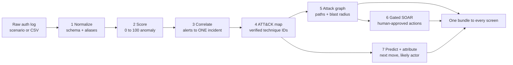

# Resilience Graph AI — Problem, Approach, and Every Feature

> **Living document — update every working session.** Last updated: 2026-07-22.
>
> A judge-facing brief: what PS-7 asks for, the specific problem we solve, how we
> solve it, and every feature with the failure it attacks. Companion to
> [PITCH_DECK.md](PITCH_DECK.md) and [EXPLAINER.md](EXPLAINER.md). Every number is
> real and traceable to `reports/metrics.json`, `reports/scaling_measurements.json`,
> or a labelled external citation.

---

## Part 1 — The problem

### 1a. What PS-7 actually asks for

PS-7 is **"AI-Driven Cyber Resilience for Critical National Infrastructure."** The
operative word is *resilience*, not *detection*. Resilience means four capabilities
in sequence: **anticipate** an attack, **detect** it while it is still unfolding,
**understand** its spread, and **respond** fast enough to contain it. A tool that
only raises alarms is not resilience; resilience is the whole loop from a weak early
signal to a contained incident.

The context PS-7 sets is specifically Indian CNI:

| Fact | Number | Source |
|---|---|---|
| Incidents handled by CERT-In in 2023 | 1.59 million and above | CERT-In |
| Indian government entities on end-of-life IT | Over 70 percent | PS-7 brief |
| Global median attacker dwell time | About 10 days | Mandiant M-Trends 2024 |
| Real Indian precedents | AIIMS Delhi ransomware (2022), CBSE breaches (2024, 2026) | Public reporting |

The common thread in those precedents is the important part: they were **not** exotic
zero-days. They were quiet intrusions using **valid stolen credentials** and **lateral
movement** — the attacker logs in legitimately, machine by machine, until they reach
something valuable.

### 1b. The specific problem we solve

Modern attackers on CNI deliberately look normal. They steal one password and
authenticate their way across the network. **Every single login they make is
individually valid and individually boring.** That produces three failures, which all
share one root cause.

| Failure | Why it happens |
|---|---|
| Low-and-slow evades signatures | Valid credentials match no known-bad rule. Antivirus, firewalls and threshold rules all look for something unauthorised, and nothing here is. |
| Alert fatigue | Every event is scored alone, so one intrusion becomes thousands of disconnected alerts. On our real campaign that is 1,192 alerts for 1 attack. Analysts triage rows, miss the pattern, burn out. |
| No blast-radius view | Even when one alert is investigated, nobody can see the path from a compromised workstation to the patient database, or answer the only question that matters mid-incident: which single machine do we unplug first? |

**The root cause and our thesis:** the data needed to catch these attacks already
exists, in the authentication logs organisations already collect and pay to store. The
missing piece is not more sensors, it is **the layer that connects those
individually-boring events into one story, in time.** That layer is what we built. It
is why the system needs **no new sensors, no endpoint agents, and no infrastructure
change** — a decisive advantage for the 70 percent of entities that cannot fund a
24 by 7 SOC.

---

## Part 2 — How we solve it

### The core idea: behavioural intelligence, not signature intelligence

We never tell the model what an attack looks like (impossible, since attackers invent
new things). Instead we teach it what **normal** authentication behaviour looks like
for each account, and measure deviation. This is the only approach that catches an
attack nobody has catalogued yet. A nurse logs into the same three machines daily; an
attacker using her account touches twenty she has never touched, and that behavioural
gap is what we detect.

### The pipeline: seven stages, one live function call

Everything runs **live, per request**, inside one function `analyze_events()`. Submit
a log, a shipped scenario or your own CSV, and all seven stages execute on it.

- **Stages 1 and 2 are Engine 1 (detection):** turn each raw login into 7 behavioural
  features, then score every event 0 to 100 with a benign-trained IsolationForest.
- **Stages 3 to 6 are the shared spine (understanding and response):** group alerts
  into ONE incident, map each behaviour to a real MITRE ATT&CK technique, build the
  attack-path graph, and recommend human-gated containment.
- **Stage 7 is Engine 2 (looking forward and outward):** predict the next technique and
  rank the likely threat actor.

This maps directly onto PS-7's resilience loop: **anticipate** (Threat Radar and
prediction), **detect** (Engine 1), **understand** (correlation and graph),
**respond** (gated SOAR).

**Proven on real data (LANL red-team campaign):**

| Output | Value |
|---|---|
| Events analysed, alerts, incidents | 2,732, then 1,192, then 1 |
| Compromised accounts | 104 |
| Attack graph | 479 hosts, 502 movements, 4 attacker pivots |
| Concentration | C17693 alone carries 670 of 702 red-team events |
| Crown jewels reachable, total exposure | 18 reachable, 475 hosts |
| Isolate one host (C17693) | cuts 463 hosts of blast radius |
| Detection | ROC-AUC 0.988 against 702 real labelled attack events, zero attack labels in training |

---

## Part 3 — Every feature, and how it attacks the problem

### 1. Analyze any log (scenario pick or CSV upload), live per request
**What it is:** Choose a shipped scenario or upload your own authentication CSV; the
entire application re-renders on that data. Robust to real logs: it resolves column
aliases (`username` or `account`, `src` or `source`, `dst`) and accepts timestamps as
epoch integers or ISO-8601 strings.
**How it solves the problem:** This is the proof that the product is a real analysis
engine, not a demo reel. A judge can drop in their own log and watch all seven stages
run. It directly answers the deployability requirement, an operator points it at logs
they already have, with no integration project needed.

### 2. Campaign view, all 104 accounts as one incident
**What it is:** Instead of collapsing to a single victim, it shows the entire campaign:
all 104 compromised accounts in one correlated incident.
**How it solves the problem:** This is the direct antidote to alert fatigue. A real
intrusion touches many accounts; a per-victim view fragments the story. The campaign
view is what turns 1,192 scattered alerts into the one thing an analyst can act on.

### 3. Per-account drill-down
**What it is:** Open any single account and get its own scoped incident, graph and
report, recomputed live for that account.
**How it solves the problem:** Resilience needs both altitudes. The campaign view
answers "are we under attack"; the drill-down answers "what exactly did this account
do." It lets a responder investigate one suspicious identity without losing the
campaign context.

### 4. Attack-path graph
**What it is:** Every alert becomes an edge in a directed host-to-host movement graph.
Click any machine to see every authentication involving it. It computes blast radius
across all attacker pivots, not just one.
**How it solves the problem:** This is the fix for the missing blast-radius view, the
feature that answers "which machine do we unplug first." It surfaces the killer
operational fact: isolate C17693, sever 463 hosts. It also fixed a real bug where
assuming a single entry point under-reported exposure and wrongly cleared four crown
jewels; reachability is now unioned over every pivot.

### 5. Live event scoring
**What it is:** Score a single authentication event on demand, on stage, using the real
trained IsolationForest, returning a 0 to 100 anomaly score with fixed calibration
anchors, so a score means the same thing on every input.
**How it solves the problem:** It makes the detection engine tangible and auditable in
real time. A skeptic can hand it one event and watch the model react, proving the
scores are computed, not canned.

### 6. Next-technique prediction
**What it is:** A first-order Markov model ranks the attacker's likely next MITRE
technique with a genuine transition probability (for example `T1566.001 to T1566.002 at
52.5 percent`), learned from 205 real attack sequences.
**How it solves the problem:** This is the anticipate half of resilience, getting ahead
of the attacker instead of only reacting. It is deliberately honest: it beats a
purpose-built kill-chain baseline 5.2 times (proving it learns real transitions, not
just an ordering), and we shipped Markov over an LSTM that lost at this data scale.

### 7. Actor attribution
**What it is:** Ranks which of 172 known MITRE threat groups the observed behaviour
resembles, via transparent weighted retrieval, coverage (0.55) plus Jaccard (0.20) plus
semantic similarity (0.25), with a printed justification for every result.
**How it solves the problem:** It replaces hours of manual threat-intelligence reading
with a ranked, auditable answer. Crucially it is transparent retrieval, not a black-box
classifier, so an analyst can audit the reasoning, which is what makes it trustworthy in
a security decision.

### 8. Threat Radar
**What it is:** Pulls free, legitimate external CTI feeds, maps each item to real ATT&CK
identifiers, ranks India-relevant items first (CERT-In, NCIIPC, UPI, Aadhaar,
India-targeting actors), and cross-references them against your current incident.
**How it solves the problem:** This is the outward-facing anticipate capability, and it
fits the Indian focus precisely. It connects "what is happening in the wild" to "where
you are exposed." It is also a demonstration of honesty: no social-media scraping
(rejected for terms-of-service and mis-attribution risk), and "no matches" is shown
plainly rather than faked.

### 9. Audit-ready report
**What it is:** A printable and downloadable incident report suitable for compliance
records.
**How it solves the problem:** Resilience includes the aftermath; regulators and CERT-In
require documentation. This turns a live investigation into a defensible artifact, which
matters for exactly the regulated CNI operators (hospitals, exam boards, grid) the PS
targets.

### 10. Gated SOAR, simulated by design
**What it is:** Generates recommended containment seeded from real MITRE mitigations for
the observed techniques, gated by severity: anything touching a critical asset requires
human approval.
**How it solves the problem:** This is the respond stage. The human gate is the point,
resilience for CNI cannot mean an AI unplugging a hospital's servers autonomously. Every
action is labelled simulated because there is no live network to act on, and we state
that up front rather than implying autonomous execution.

### 11. India scenarios shipped (AIIMS and CBSE)
**What it is:** Two scenarios, hospital ransomware (AIIMS-style) and exam-board breach
(CBSE-style), as synthetic logs styled after the real reported incidents, labelled
synthetic in the interface.
**How it solves the problem:** They make the problem statement's own precedents runnable
end to end, letting a judge see the pipeline against the exact threat classes PS-7 names.

### 12. LIVE and SAMPLE provenance badge
**What it is:** A top-bar badge, always visible, reading LIVE ANALYSIS or SAMPLE DATA.
**How it solves the problem:** It is the honesty backbone of the whole product, a viewer
can always tell whether what they see was computed just now from their data or is the
shipped sample (which is itself a real analysis of a shipped log, via the same
pipeline). It is a correctness feature, not decoration, and it underpins the "nothing
fabricated on screen" rule.

### 13. Live Incident replay and streaming
**What it is:** Event-by-event replay of an incident, served over Server-Sent Events
(`/analyze/stream`), alongside live scoring and the report.
**How it solves the problem:** It reconstructs the attacker's timeline as a narrative a
human can follow, which is the concrete form of turning alerts into a story.

---

## The through-line for a judge

Every feature is one link in PS-7's resilience loop, and each attacks one of the three
failures.

| PS-7 resilience stage | Features | Failure it fixes |
|---|---|---|
| Anticipate | Threat Radar, Next-technique prediction | Gets ahead of low-and-slow attacks |
| Detect | Analyze any log, Live event scoring (Engine 1) | Catches valid-credential attacks signatures miss |
| Understand | Campaign view, Per-account drill-down, Attack-path graph, Live Incident, Actor attribution | Ends alert fatigue and the missing blast-radius view |
| Respond | Gated SOAR, Audit-ready report | Turns understanding into contained, documented action |
| Trust throughout | LIVE and SAMPLE badge, honesty rules | Makes it credible to a regulated operator |

**One-line summary:** the logs already know an attack is happening. Resilience Graph AI
is the layer that listens, connects the weak signals into one story, and turns weeks of
undetected dwell into a contained incident in minutes, using only the data an operator
already has.
