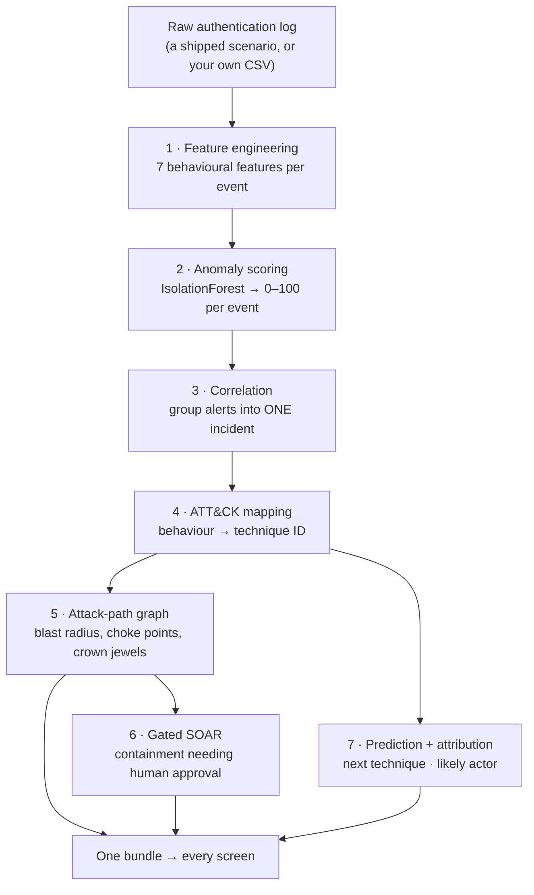
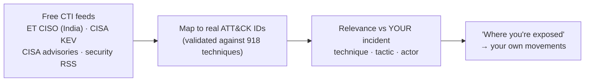

# Resilience Graph AI — The Complete Explainer

> **Living document — update every working session.** Last updated: 2026-07-19.
>
> **Who this is for:** everyone. If you've never heard of MITRE ATT&CK, start at the top and
> read straight through — every term is explained in plain English the first time it appears.
> If you're a security engineer, the 🔬 **Under the hood** boxes carry the exact parameters,
> thresholds, formulas and honest limitations; skim the plain-English parts and dwell there.
>
> **Rule for this document:** every number is real and traceable to a file in this repo.
> Nothing is rounded up, nothing is aspirational.

---

## Table of contents

1. [The 60-second version](#1-the-60-second-version)
2. [Cybersecurity in 10 minutes (no background needed)](#2-cybersecurity-in-10-minutes)
3. [The problem we're solving](#3-the-problem-were-solving)
4. [How our system works, end to end](#4-how-our-system-works-end-to-end)
5. [Engine 1 — finding the attack](#5-engine-1--finding-the-attack)
6. [The spine — turning alerts into a story](#6-the-spine--turning-alerts-into-a-story)
7. [Engine 2 — predicting and attributing](#7-engine-2--predicting-and-attributing)
8. [Threat Radar — the outside world](#8-threat-radar--the-outside-world)
9. [The application](#9-the-application)
10. [Data: what we used and why](#10-data-what-we-used-and-why)
11. [Results, in full](#11-results-in-full)
12. [How we kept ourselves honest](#12-how-we-kept-ourselves-honest)
13. [Engineering: testing, deployment, reproducing it](#13-engineering-testing-deployment-reproducing-it)
14. [Limitations we will state before you find them](#14-limitations-we-will-state-before-you-find-them)
15. [Glossary](#15-glossary)

---

## 1. The 60-second version

An attacker breaks into a hospital network. They don't smash anything — they steal one
employee's password and quietly log into machine after machine, looking for the patient
database. Every single one of those logins looks *completely normal* on its own. That's why
they go undetected for a median of ~10 days.

**Resilience Graph AI reads the boring login logs an organisation already collects and finds
the story hidden across them.** On real red-team attack data it:

- scores **2,732** authentication events, flags **1,192** as anomalous, and collapses them
  into **one** incident instead of 1,192 separate alerts;
- draws the attacker's movement across **479 machines**, identifies **4 attacker-controlled
  hosts**, and finds that isolating just **one** of them severs **463 machines** of exposure;
- maps each step to the industry-standard MITRE ATT&CK catalogue, predicts the attacker's
  likely next move, ranks which known threat group it resembles, and recommends containment
  that a human must approve.

It detects with **ROC-AUC 0.988** against 702 real labelled attack events — and it never
saw a single attack label during training.

---

## 2. Cybersecurity in 10 minutes

*Skip this section if you already work in security.*

### 2.1 What "logs" are

Every time you log into a work computer, a record is written: *who* logged in, *from* which
machine, *to* which machine, at what time, whether it succeeded. A big organisation generates
millions of these a month. Our main dataset has **11.2 million** of them.

A single record looks roughly like:

```
timestamp=766788  user=U66@DOM1  source=C17693  destination=C3435  status=success  protocol=NTLM
```

Nothing about that line is alarming. That's the whole problem.

### 2.2 How a real intrusion actually unfolds

Attackers rarely "hack in" through a firewall like the movies. The common path:

1. **Initial access** — someone gets phished; the attacker now has a valid username and password.
2. **Lateral movement** — using those *legitimate* credentials, they log into other machines,
   hunting for something valuable. This is the long, quiet phase.
3. **Objective** — reach the crown jewel (patient database, exam papers, control system) and
   steal, encrypt, or tamper with it.

Step 2 is where they're catchable, because their *behaviour* differs from a real employee's
even though their *credentials* are perfectly valid. A nurse logs into the same three machines
every day. An attacker using the nurse's account touches twenty machines she's never touched.

### 2.3 Why traditional defences miss this

| Defence | How it works | Why it misses low-and-slow attacks |
|---|---|---|
| **Antivirus / signatures** | Matches known-bad files and patterns | The attacker uses no malware — just valid logins |
| **Firewall** | Blocks unauthorised network connections | The attacker is already inside, using allowed paths |
| **Simple rules** ("alert on 5 failed logins") | Threshold on one metric | Real attackers are patient and stay under thresholds |

### 2.4 The two terms you need for the rest of this document

**MITRE ATT&CK** — a free, public catalogue maintained by the MITRE Corporation that names
every known attacker technique with an ID. For example:

| ID | Name | Plain English |
|---|---|---|
| `T1110` | Brute Force | Guessing passwords by trying many |
| `T1550.002` | Pass the Hash | Reusing a stolen password *fingerprint* to log in without knowing the password |
| `T1021` | Remote Services | Using legitimate remote-login tools to move machine to machine |
| `T1486` | Data Encrypted for Impact | Ransomware encrypting files |

It's the common vocabulary of the industry — like a disease classification system for attacks.
It has ~918 techniques in the version we use, grouped into **tactics** (the attacker's goal at
that stage: *credential access*, *lateral movement*, *impact*, etc.).

**Anomaly detection** — instead of listing what's *bad* (impossible; attackers invent new
things), you teach a model what **normal** looks like and flag deviations. This is how you
catch an attack nobody has seen before.

---

## 3. The problem we're solving

### 3.1 The Indian context

| Fact | Number | Source |
|---|---|---|
| Incidents handled by CERT-In in 2023 | **1.59 million+** | CERT-In |
| Indian government entities running end-of-life IT | **70%+** | PS7 problem brief |
| Global median attacker dwell time | **~10 days** | Mandiant M-Trends 2024 |

Real precedents this project is built around:

- **AIIMS Delhi (2022)** — ransomware took India's premier hospital's systems down for days.
- **CBSE (2024, 2026)** — breaches at the national school examination board.

*(CERT-In is India's national Computer Emergency Response Team — the government body
organisations report cyber incidents to.)*

### 3.2 The three failures

1. **Low-and-slow evades signatures.** Valid credentials match no known-bad rule.
2. **Alert fatigue.** Each event is scored alone, so one attack becomes thousands of separate
   alerts. Analysts triage rows, miss the pattern, and burn out.
3. **No blast-radius view.** Even when an alert is investigated, nobody can see the *path* from
   a compromised workstation to the patient database, or which single machine to unplug.

**The insight this project is built on:** the data needed to catch these attacks already exists
in logs organisations already collect. The missing piece is the layer that *connects* it.

---

## 4. How our system works, end to end



Seven stages. Stages 1–2 are **Engine 1** (detection). Stages 3–6 are the **shared spine**.
Stage 7 is **Engine 2** (prediction and attribution). Everything runs **live, per request** —
upload a log and all seven stages execute on your data.

🔬 **Under the hood.** The whole pipeline is one function: `src/shared/live_analyze.py ::
analyze_events(df, critical_assets, incident_id, account)`. It returns a single bundle with
per-screen payloads (`overview`, `incident`, `graph`, `threat_intel`, `report`, `attackers`,
`meta`). The offline cache builder calls the *same* function on a shipped scenario, so the
"sample" data in the app is itself a real analysis — there is no separate mock path.

---

## 5. Engine 1 — finding the attack

### 5.1 The idea in plain English

We never tell the model what an attack looks like. We show it a huge amount of **normal**
behaviour and ask: *how unusual is this event?* Anything strange floats to the top.

The trick is choosing *what to measure*. Raw log fields (username, hostname) are useless —
they're just identifiers. So we compute **behavioural** features that capture how a person
normally moves through the network.

### 5.2 The seven features

| Feature | Plain English | Why an attacker trips it |
|---|---|---|
| `new_dst_for_user` | First time this account has ever logged into this machine | Attackers explore machines the real user never touches |
| `new_src_for_user` | First time this account logged in *from* this machine | The attacker works from their own foothold machine |
| `user_distinct_dst_sofar` | How many different machines this account has touched so far | Rapid fan-out is hunting behaviour |
| `user_fail_rate_sofar` | Running share of failed logins for this account | Credential guessing leaves failures |
| `dst_rarity` | How rarely anyone logs into this destination | Attackers reach obscure, high-value servers |
| `is_fail` | Did this login fail | Basic signal |
| `is_ntlm` | Was an older authentication protocol used | Pass-the-hash attacks rely on it |

**How well do they actually separate attackers from normal users?** From the real LANL data:

| Feature | Benign average | Attacker average | Ratio |
|---|---|---|---|
| `new_dst_for_user` | 0.0204 | **0.2821** | **13.8×** |
| `new_src_for_user` | 0.0174 | **0.1054** | **6.1×** |
| `dst_rarity` | 4.8715 | **9.8256** | **2.0×** |
| `user_fail_rate_sofar` | 0.0015 | **0.0081** | **5.4×** |
| `is_ntlm` | 0.0580 | **1.0000** | 100% of attacks |

The attacker's *behaviour* is 13.8× more likely to involve a machine that account has never
visited. That single fact is most of the detection.

🔬 **Under the hood.** Features are computed vectorised and **chronologically per user** in
`src/engine1/lanl_detect.py :: engineer()` — `new_dst_for_user` is `~df.duplicated(['user',
'destination_host'])`, fan-out is a `cumsum` of that within a user group, fail-rate is
`cumsum(is_fail) / cumcount()`, and `dst_rarity` is `-log(count(dst) / total)`. Critically,
all running statistics use **only prior events** for that user, so there is no look-ahead
leakage into the score of any given event.

### 5.3 The model

**IsolationForest** — an algorithm that isolates outliers by randomly splitting the data.
Anomalies get isolated in fewer splits, because they sit apart from the crowd. Fast, needs no
labels, and works well in high dimensions.

🔬 **Under the hood.**
- `IsolationForest(n_estimators=200, max_samples=4096, contamination="auto", random_state=42)`,
  fitted on a **random sample of 800,000 benign-only rows** (`label == 0`).
- Features are `StandardScaler`-normalised, fitted on the training sample only.
- Anomaly score = `-score_samples(X)`, then min-max calibrated to 0–100 using **fixed anchors**
  stored in `api/cache/score_ref.json` (`lo` = a canonical benign feature vector, `hi` = a
  canonical malicious one). Fixed anchors, not per-batch min/max, so scores mean the same thing
  across different uploads and match the single-event `/api/score-event` endpoint exactly.
- **Labels are used for evaluation only.** They never enter training. This is what makes the
  0.988 defensible rather than circular.

We also trained a small PyTorch autoencoder on CIC-IDS2017 as a comparison (reconstruction
error as the anomaly score). It won there (PR-AUC 0.570 vs 0.473) and is reported — but the
LANL detector is IsolationForest, and we say which is which.

---

## 6. The spine — turning alerts into a story

This is the part that turns a pile of alerts into something a human can act on.

### 6.1 Correlation: 1,192 alerts → 1 incident

Any event scoring ≥ 50 becomes an "alert". Rather than emitting 1,192 alerts, we group them
into a single incident with a timeline, a severity, an account list, and an ordered chain of
ATT&CK techniques.

🔬 **Under the hood** (`src/shared/correlate.py`). `ALERT_THRESHOLD = 50`;
`SESSION_GAP = 3600 s` (an hour of silence starts a new session). Incident severity is the
max event score bucketed: **≥ 90 critical**, **≥ 75 high**, **≥ 50 medium**, else low. The
`technique_ids` chain is de-duplicated but keeps first-seen order, so it reads as a narrative.

### 6.2 ATT&CK mapping: behaviour → technique

We infer the technique from the *behaviour*, not from a text label:

| Observed behaviour | Mapped technique |
|---|---|
| Login failed | `T1110` Brute Force |
| New machine + old auth protocol | `T1550.002` Pass the Hash |
| New machine | `T1021` Remote Services |
| Neither | Normal activity |

🔬 **Under the hood** (`src/shared/attack_mapper.py`). Technique names, descriptions and
mitigations are read from `attack_lookups.pkl`, parsed from the **official MITRE ATT&CK STIX
bundles** (Enterprise + ICS + Mobile → **918 techniques, 175 groups**). The explanation text
shown in the UI is the *real* first sentence of MITRE's description — we never generate
technique prose with a language model, so a hallucinated technique ID is structurally
impossible.

### 6.3 The attack-path graph

Every alert becomes an edge in a directed graph: `source_host → destination_host`. From that
graph we compute what a responder actually needs:

| Question | Graph answer | Live result |
|---|---|---|
| Where did the attacker operate from? | Nodes with outbound movement | **4 pivots**; `C17693` alone carries **670 of 702** red-team events |
| How far can they reach? | Reachable set from **any** pivot | **475 hosts** |
| Which valuable machines are exposed? | Shortest path to each crown jewel | **18 crown jewels** reachable |
| What do we unplug first? | Betweenness centrality | Isolating `C17693` **cuts 463 hosts** |

🔬 **Under the hood** (`src/shared/attack_graph.py`). `networkx.DiGraph`; blast radius is the
union of `descendants()` over **every** pivot (an earlier single-entry version under-reported
463 vs the true 475 and wrongly cleared four crown jewels — fixed, with a regression test).
Choke points are the top-3 by `betweenness_centrality`. We deliberately report two distinct
numbers: **total exposure** (475) and **what isolating one host actually severs** (463).

**On "crown jewels":** LANL is anonymised and has **no asset-criticality labels** — every row
says `medium`. So we derive them from a stated heuristic: *the hosts the most distinct accounts
authenticate to* (i.e. domain controllers, auth and file servers). The red team reached **13 of
the estate's top-20 most-depended-on servers**, including one that **17,808 accounts** rely on.
In a real deployment the operator supplies their asset list instead — it's already an input
parameter, not a hard-coded value.

### 6.4 Gated SOAR

*SOAR = Security Orchestration, Automation and Response — the tooling that takes action after
detection.* We generate recommended containment, seeded from the **real MITRE mitigations** for
the observed techniques, and gate it:

| Situation | Action mode |
|---|---|
| Critical asset involved | **requires human approval** |
| High / critical severity | simulate containment |
| Medium | create ticket + enrich |
| Low | monitor only |

🔬 **Under the hood** (`src/shared/soar.py`). Every action is **simulated** — there is no live
network to isolate hosts on, and we label that everywhere rather than implying autonomous
execution. Mitigations come from `technique_to_mitigations` in the parsed ATT&CK data, so the
advice is MITRE's, not ours.

---

## 7. Engine 2 — predicting and attributing

### 7.1 Predicting the next move

Given the techniques observed so far, what comes next? We learned technique-to-technique
transitions from **201 real attack sequences** (145 MITRE groups + 56 campaigns, every one with
≥ 6 techniques) plus **4 analyst-verified CERT-In advisories** — 205 in total.

| Method | Top-3 accuracy |
|---|---|
| Most-frequent baseline | 5.3% |
| Kill-chain-order baseline ⚠️ | 7.1% |
| LSTM over MiniLM embeddings | 28.4% |
| **Markov 1st-order — what we ship** | **36.5%** |

**Two things here matter more than the number:**

**The circularity trap, and how we escaped it.** Our sequences are ordered using MITRE's
kill-chain tactic order (recon → … → impact). A model could score well by simply re-learning
*that ordering* rather than learning anything about attacks. So we built a **kill-chain-order
baseline** whose entire strategy is to exploit that ordering — and required our model to beat
it. **Markov beats it 5.2×** (36.5% vs 7.1%), which is evidence we're predicting real
technique-to-technique transitions.

**We shipped the model that won, not the impressive one.** The LSTM (a neural network over
sentence-transformer embeddings) scored **28.4%** — it *lost* to a first-order Markov chain at
this data scale. We ship the Markov model and publish the neural result as a documented
negative. Honest beats fancy.

🔬 **Under the hood** (`src/engine2/build_predictor.py`). The Markov table stores
`{last_technique: [[next_technique, count], …]}`, so `/api/predict-next` returns a genuine
first-order transition probability (`count / total`) — e.g. `T1566.001 → T1566.002 @ 52.5%`.
Unseen states back off to a frequency-ranked list, and those predictions are explicitly scored
**0.0** because there is no observed transition evidence for them. Splits are at the
**sequence** level (never within a sequence), which prevents leakage.

**The non-circular India test.** The 4 CERT-In sequences are ordered by the *real reported
timeline*, not our heuristic, and live only in the test set. Markov scores **10.0%** top-3 on
them versus 36.5% on the auto-ordered set. That gap is a finding, not a failure: **real
attacker orderings are harder**, which proves part of the 36.5% was ordering-driven. We publish
both numbers.

### 7.2 Attributing the actor

Given the observed techniques, which known threat group does this resemble? We score the
observed technique set against all **172 MITRE group profiles**.

🔬 **Under the hood** (`src/engine2/attribution.py`). Transparent, weighted retrieval:

```
score = 0.55 · coverage  +  0.20 · jaccard  +  0.25 · semantic_similarity
```

where *coverage* = fraction of observed techniques in the group's public profile, *jaccard* =
set overlap, and *semantic similarity* = cosine between MiniLM embedding centroids of the
technique descriptions. Every result carries a generated justification string ("matches 3/4
observed techniques; profile coverage 75%; semantic similarity 0.62").

**The honest caveat we state before anyone asks:** the built-in evaluation (hide 40% of a
group's profile, retrieve the group from the rest) scores **100% top-1** — which is
**near-trivial by construction**, because you're retrieving a public profile from a piece of
itself. We never headline it. This is transparent retrieval with a printed rationale, **not a
trained classifier**, and on an auth-only log with three techniques the ranked actor is
*context*, not a conclusion.

---

## 8. Threat Radar — the outside world

A SOC also needs to know what's happening *outside*. Threat Radar pulls free, legitimate
threat-intelligence feeds, maps them to ATT&CK, and cross-references them with **your** incident.



**India-first**, because PS7 is about Indian infrastructure: items mentioning India, Indian
agencies (CERT-In, NCIIPC), Indian sectors (UPI, Aadhaar, RBI) or India-targeting actors
(APT36, SideWinder) rank first — currently 10 of 40 items.

🔬 **Under the hood** (`src/shared/osint.py`). Stdlib-only HTTP/XML (`urllib` + `xml.etree`)
so the deployed image gains **zero dependencies**. Each feed is isolated — one dead source
reports itself and never breaks the radar. Technique mapping is deliberately **precision-first**:
explicit `T####` mentions, then a curated 70-phrase alias table, then technique-name matching —
but with reconnaissance and resource-development techniques **excluded** from name matching,
because their names are generic English nouns ("Software", "Vulnerabilities", "Artificial
Intelligence") that false-positived on ordinary prose. Every ID is validated against the real
lookups before it's shown.

**Three honest notes:**
- **CERT-In has no working feed.** Their RSS URL returns HTTP 200 with an HTML "URL not found"
  page — a soft 404. We detected it, excluded the source, and added a guard that rejects
  HTML-masquerading-as-RSS.
- **No social-media scraping.** Evaluated and rejected: it violates platform terms, is actively
  blocked, and person-level attribution from public posts risks naming the wrong people.
- **"No matches" is a legitimate result.** Our demo incident is authentication-based while the
  news is vulnerability/malware-based, so exact matches are often zero. The UI says so plainly
  rather than manufacturing a hit.

---

## 9. The application

A FastAPI backend serving a React SPA — eight screens, all rendering **live analysis output**.

| Screen | What it shows |
|---|---|
| **Analyze Log** | Pick a shipped scenario or upload your own CSV → runs the full pipeline |
| **Overview** | Time-to-first-alert, active incident, detector benchmarks |
| **Attackers** | All 104 compromised accounts; open any one for its own scoped incident |
| **Live Incident** | Event-by-event replay, live event scoring, audit-ready report |
| **Attack Graph** | Interactive host graph, click any host, filter by account |
| **Threat Intel** | ATT&CK mapping, ranked actors, live next-technique prediction |
| **Threat Radar** | External CTI cross-referenced with your incident |
| **Models & Metrics · Data & Methodology** | The evidence tables and honesty notes |

**The most important UI element** is the topbar badge: **LIVE ANALYSIS** vs **SAMPLE DATA**.
A viewer can always tell whether what they're seeing was computed just now.

🔬 **Under the hood.** `POST /api/analyze` (scenario, raw events, or multipart CSV upload) runs
the full spine per request; `/api/score-event` and `/api/predict-next` are live single-shot model
calls; `/api/analyze/stream` is Server-Sent Events for per-event streaming; `/api/threat-radar`
scores CTI against a supplied incident context. The cached `GET` endpoints serve a sample that
is *itself* a real analysis of a shipped log. Frontend state lives in an `AnalysisProvider`
context whose `useScreenData(key, cachedFetcher)` hook prefers a loaded live bundle and falls
back to the cached sample — which is why every screen updates from one analysis.

**Robustness for real-world uploads:** the schema layer resolves **column aliases**
case-insensitively (`username`/`account` → `user`, `src`/`source` → `source_host`, `dst` →
`destination_host`, `proto` → `protocol`), and accepts timestamps as **either** epoch integers
**or** ISO-8601 strings. Both came from real failures — the ISO-8601 crash was found by
automated browser testing and fixed with a regression test.

---

## 10. Data: what we used and why

| Dataset | Size | Why it's here |
|---|---|---|
| **LANL Cyber Security Events** | 11.2M auth events, **702 labelled red-team events** | The moat: a *real* attack campaign with ground truth |
| **CIC-IDS2017** | 2.3M network flows | Network-level anomaly benchmark with attack families |
| **UNSW-NB15** | 175k/82k official split | Second benchmark — shows we generalise |
| **MITRE ATT&CK** (Enterprise + ICS + Mobile) | 918 techniques, 175 groups | The technique vocabulary, mitigations, group profiles |
| **CERT-In advisories** | 4 analyst-verified sequences | Real Indian attack timelines for the non-circular test |

**Why LANL matters most:** it's a real 58-day capture from Los Alamos National Laboratory
including an actual red-team exercise, with the attacker's events **labelled**. That means we
can prove detection rather than assert it.

🔬 **Under the hood.** The raw LANL auth file is ~70 GB uncompressed. `src/engine1/prep_lanl.py`
**streams** the gzip (519M lines read, never fully decompressed), keeps every event involving a
compromised user plus a 1-in-400 background sample, joins the red-team labels on
`(time, src_user, src_comp, dst_comp)`, and early-exits once past the attack window. Result:
11.2M rows, 702 malicious (98.2% of the 715 red-team records have exact auth counterparts — a
known dataset quirk we state rather than hide). CIC-IDS2017 is split **by day** (train Mon–Wed
benign only, test Thu–Fri with 7 unseen attack families) to prevent temporal leakage, with
`Destination Port` dropped so the model can't memorise identifiers.

**Mobile ATT&CK was added mid-project** because a teammate's verified CERT-In advisory described
an Android banking trojan whose techniques (`T1660`, `T1636`, `T1638`…) didn't exist in the
Enterprise+ICS lookups — every ID would have been silently discarded. Adding the Mobile matrix
took the catalogue from 794 → **918 techniques**, which matters because India's threat landscape
is mobile-heavy.

---

## 11. Results, in full

### Detection (Engine 1)

| Dataset | Metric | Result |
|---|---|---|
| LANL | **ROC-AUC** | **0.988** |
| LANL | TPR @ 5% FPR | **96.9%** (680/702 caught) |
| LANL | TPR @ 1% FPR | 51.4% |
| LANL | Behavioural-only ROC (NTLM removed) | **0.929** |
| CIC-IDS2017 | PR-AUC — autoencoder | **0.570** |
| CIC-IDS2017 | PR-AUC — IsolationForest | 0.473 (**3.1× random**, **4.8× rule**) |
| CIC-IDS2017 | PR-AUC — random baseline | 0.155 |
| CIC-IDS2017 | PR-AUC — naive rule baseline | 0.098 (**worse than random**) |
| UNSW-NB15 | ROC-AUC | **0.829** |

**Two results worth dwelling on.**

*The NTLM ablation.* 100% of the red-team logins used the older NTLM protocol versus ~6% of
benign ones — a powerful but **dataset-specific and evadable** signal (the attacker could just
switch protocols). So we deleted that feature and re-ran: **ROC-AUC 0.929**. The detection is
driven by generalisable behaviour, not one brittle artifact. Most teams would have kept the
0.988 quietly.

*The rule baseline is worse than random.* A naive "high packet rate" rule scores PR-AUC 0.098
against a random floor of 0.155 — because stealthy attacks have *low* volume. We report this
because it's exactly why simple thresholds fail.

### Prediction & attribution (Engine 2)

| Metric | Result |
|---|---|
| Markov top-3 (auto sequences) | **36.5%** |
| Anti-circularity: Markov ÷ kill-chain baseline | **5.2×** |
| LSTM top-3 (documented negative) | 28.4% |
| CERT-In verified sequences, top-3 | **10.0%** |
| Technique embeddings: same-tactic vs random cosine | **0.412** vs 0.327 |
| ATT&CK group profiles | 172 |

### Operational (live campaign analysis)

| Output | Value |
|---|---|
| Events analysed → alerts → incidents | 2,732 → **1,192** → **1** |
| Compromised accounts | 104 |
| Attack graph | 479 hosts, 502 movements, 4 pivots |
| Crown jewels reachable | 18 |
| Total exposure | 475 hosts |
| Isolating one choke point | cuts **463** hosts |

---

## 12. How we kept ourselves honest

Four rules we set at the start and held to, including when they cost us numbers.

**1. Never report accuracy.** At 0.006% attack prevalence, a model that says "benign" every
time scores 99.994% accuracy and catches nothing. We report **PR-AUC** (robust to imbalance)
and **TPR at a fixed false-positive rate** (what an analyst actually experiences).

**2. Always show baseline lift.** Random and rule baselines were built **first**, before the
real model, so we couldn't tune toward a flattering comparison. When the rule baseline came out
worse than random, we published that.

**3. Build the baseline designed to beat you.** The kill-chain-order baseline exists purely to
test whether our predictor was cheating. We report the 5.2× margin — and when the LSTM lost to
Markov, we shipped Markov.

**4. Nothing fabricated on screen.** Every displayed number traces to the current analysis or a
labelled citation. During the build we removed several things of our own that failed this test:

| What we removed | Why |
|---|---|
| Invented sparkline data | The trend arrays were decorative fiction; replaced with real anomaly scores |
| A hard-coded "4 min / 21 days" MTTD claim | Now measured from the log's own timestamps; industry dwell shown as a **cited** comparison |
| A fabricated "crown jewel" | It was literally the middle element of a list, presented as a finding; replaced with a stated, defensible heuristic |
| A stale "5.1×" anti-circularity claim | Our own report said 4.7× at the time; we found the drift in a self-audit and fixed the pipeline so metrics can no longer drift |

That last one led to a structural fix: evaluation scripts now write `reports/metrics.json`,
which the UI reads directly. **Hand-copied numbers can no longer go stale.**

---

## 13. Engineering: testing, deployment, reproducing it

### Testing

| Layer | Coverage |
|---|---|
| **Unit / integration** | **29 pytest tests** — pipeline correctness, campaign vs per-account scoping, multi-pivot graph, cross-screen crown-jewel consistency, OSINT mapping precision, dead-feed resilience |
| **Browser end-to-end** | TestSprite drove a real browser through 15 UI flows — **14 passed** |
| **Deployment** | `docker build` verified; container smoke-tested including live CTI fetch |

**The E2E run earned its keep:** it uploaded a CSV with ISO-8601 timestamps and found a crash
(`invalid literal for int()`), because every one of our own fixtures happened to use epoch
integers. Real logs use datetimes. Fixed, with a regression test. That's a bug a judge would
have hit on stage.

Several tests exist specifically to prevent regressions we already caused once: the KEV feed is
vendor-ordered not date-ordered; a ransomware *campaign flag* must not be mapped as the
ransomware *technique*; graph edges must remember **every** account that used a host pair.

### Deployment

One Docker container: a Node stage builds the React app, a slim Python stage serves both the
API and the built SPA from the same origin. **No GPU at runtime**, and no torch —
sentence-transformer embeddings ship as a precomputed pickle. Deployed to Render via
`render.yaml`.

Because models, ATT&CK lookups, embeddings, demo scenarios and the sample cache are all
committed, **the whole app runs from a fresh clone with no dataset download**.

### Reproducing everything

```bash
# run the app (no 11 GB download needed)
pip install -r requirements-deploy.txt
python -m uvicorn api.main:app --port 8000
cd frontend && npm install && npm run dev     # → localhost:5173

# retrain from raw data (needs the datasets — see data/README.md)
pip install -r requirements.txt
python -m src.engine1.prep_lanl    && python -m src.engine1.lanl_detect
python -m src.engine1.prep_cicids  && python -m src.engine1.anomaly
python -m src.shared.parse_attack
python -m src.engine2.build_embeddings   # CPU-only: CUDA_VISIBLE_DEVICES=""
python -m src.engine2.build_sequences && python -m src.engine2.build_predictor
python -m scripts.build_cache
```

Every script writes a markdown report to `reports/` — that's the audit trail behind every
number in this document.

---

## 14. Limitations we will state before you find them

| Limitation | The honest position |
|---|---|
| **Only 3 ATT&CK techniques in the demo incident** | LANL is *authentication logs only* — no process, file or network telemetry. Auth behaviour can honestly evidence pass-the-hash, brute force and remote services. We refuse to invent techniques the data can't support; richer telemetry deepens the chain automatically. |
| **Attribution's 100% eval is near-trivial** | It retrieves a public profile from a piece of itself. Never headlined. It's transparent retrieval with a printed rationale, not a classifier. |
| **CERT-In prediction is only 10%** | The honest, non-circular number — and the gap versus 36.5% is itself the finding. Prediction is a *supporting* feature; the pitch leans on detection and correlation. |
| **Crown jewels are a heuristic** | LANL has no criticality labels. We state the heuristic; real deployments supply a CMDB asset list, which is already an input parameter. |
| **SOAR is simulated** | There's no live network to act on. Every action is labelled simulated and human-gated. |
| **India scenarios are synthetic** | AIIMS/CBSE scenarios are generated logs *styled* after real reported incidents, labelled as synthetic in the UI. The LANL campaign is the real data. |
| **In-memory graph analytics** | networkx handles ~50k events per analysis comfortably. Beyond that: shard by tenant/time window or move to a graph database. |
| **No authentication in the app** | A single-analyst demo; the login is a splash by design. Not a security claim. |

---

## 15. Glossary

| Term | Meaning |
|---|---|
| **APT** | Advanced Persistent Threat — a well-resourced attacker who stays hidden for a long time |
| **ATT&CK** | MITRE's public catalogue of attacker techniques, each with an ID like `T1110` |
| **Blast radius** | Everything an attacker can reach from where they currently are |
| **CERT-In** | India's national Computer Emergency Response Team |
| **Choke point** | A machine that many attack paths pass through — the best thing to isolate |
| **Crown jewel** | A machine worth protecting most (patient DB, domain controller) |
| **CTI** | Cyber Threat Intelligence — information about threats happening elsewhere |
| **Dwell time** | How long an attacker stays undetected inside a network |
| **False positive rate (FPR)** | Share of *normal* events wrongly flagged — what causes alert fatigue |
| **IsolationForest** | An algorithm that finds outliers by seeing how easily a point is isolated |
| **Kill chain** | The ordered stages of an attack, from recon to impact |
| **Lateral movement** | Moving machine-to-machine inside a network after getting in |
| **NTLM** | An older Windows authentication protocol, vulnerable to pass-the-hash |
| **Pass the hash** | Logging in with a stolen password *fingerprint* instead of the password |
| **PR-AUC** | Precision-Recall Area Under Curve — the right accuracy-substitute for rare events |
| **Red team** | Authorised attackers who simulate a real intrusion — their actions are the ground-truth labels |
| **ROC-AUC** | Probability the model ranks a random attack above a random benign event (1.0 perfect, 0.5 random) |
| **SIEM** | The log-collection platform a SOC runs on (Splunk, ELK…) |
| **SOAR** | Security Orchestration, Automation and Response — the "do something about it" layer |
| **SOC** | Security Operations Centre — the team watching for attacks |
| **TPR** | True Positive Rate (recall) — share of real attacks caught |
| **Unsupervised learning** | Training with no labels; the model learns "normal" and flags deviations |

---

## Where to go next

| You want… | Read |
|---|---|
| To run it | [README.md](README.md) |
| System design detail | [architecture.md](architecture.md) |
| The pitch | [PITCH_DECK.md](PITCH_DECK.md) |
| Raw evaluation output | [reports/](reports/) |
| Engineering rules we follow | [rules.md](rules.md) |
| Current project state | [memory.md](memory.md) |
