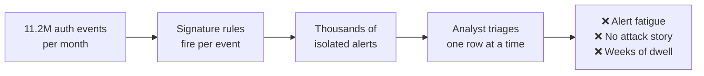
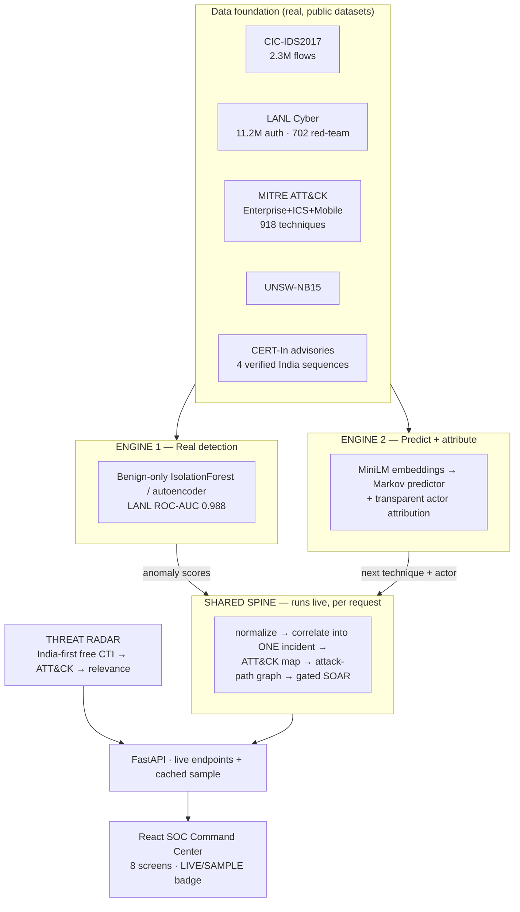
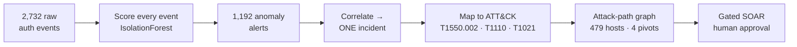
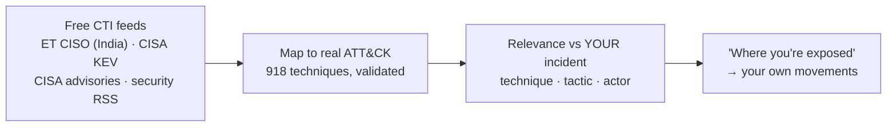
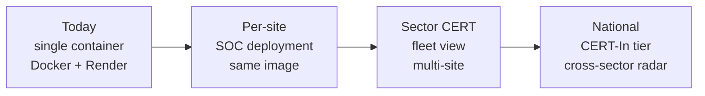

# Resilience Graph AI — Pitch Deck Content

> **Living document — update every working session.** Last updated: 2026-07-19.
>
> **How to use this file:** each `## Slide N` block is one slide. Copy the title, the body
> content, and the speaker notes straight into PowerPoint / Google Slides / Gamma.
> Mermaid blocks render at [mermaid.live](https://mermaid.live) → export PNG → paste.
> `📸 SCREENSHOT:` lines tell you exactly which app page to capture.
>
> **Every number here is real and traceable** — pulled from `reports/*.md`,
> `reports/metrics.json`, and the live analysis cache. Do not round up or embellish;
> the honesty is the differentiator. See Slide 14.

---

## Deck at a glance

| # | Slide | Purpose | Time |
|---|---|---|---|
| 1 | Title | Identity | 0:10 |
| 2 | The problem | Make them feel the stakes | 0:30 |
| 3 | Why detection fails today | Name the gap | 0:25 |
| 4 | Our solution (one sentence) | The hook | 0:20 |
| 5 | Architecture | Show the machine | 0:30 |
| 6 | Engine 1 — real detection | Technical Excellence | 0:30 |
| 7 | Engine 2 — predict & attribute | Innovation | 0:25 |
| 8 | The shared spine | Alert fatigue → one story | 0:25 |
| 9 | 🎬 LIVE DEMO | The wow | 2:00 |
| 10 | Threat Radar (India-first) | Innovation + India | 0:20 |
| 11 | Results & evidence | Proof | 0:30 |
| 12 | Business impact | 25% of score | 0:30 |
| 13 | Scalability | 15% of score | 0:20 |
| 14 | Our honesty rules | Survives Q&A | 0:25 |
| 15 | What's real vs simulated | Pre-empt the sharp question | 0:15 |
| 16 | Roadmap | Production path | 0:15 |
| 17 | Team & ask | Close | 0:15 |
| A1–A6 | Appendix (Q&A backup) | Only if asked | — |

**Judging weights to keep in mind while presenting:** Innovation 25% · Business Impact 25% · Technical Excellence 20% · Scalability 15% · UX 15%.

---

## Slide 1 — Title

**Title:** Resilience Graph AI
**Subtitle:** AI-Driven Cyber Resilience for Critical National Infrastructure
**Tag line (one line, large):** *From weeks of attacker dwell time to a correlated incident in minutes.*

**Footer:** ET AI Hackathon 2026 · Problem Statement 7 · Team [NAME] · [DATE]

📸 **SCREENSHOT:** the **Login / splash screen** (`http://localhost:5173/`) — clean, branded, sets the SOC tone. Use it as a faded full-bleed background behind the title text.

**Speaker notes:** "We built a SOC brain for critical national infrastructure. Every screen you'll see runs a live analysis on real red-team data — nothing is pre-baked."

---

## Slide 2 — The problem

**Title:** India's critical infrastructure is breached faster than it is defended

| Fact | Number | Source |
|---|---|---|
| Incidents handled by CERT-In (2023) | **1.59 million+** | CERT-In |
| Govt entities running end-of-life IT | **70%+** | PS7 brief |
| Global median attacker dwell time | **~10 days** | Mandiant M-Trends 2024 |
| Real Indian precedents | **AIIMS Delhi ransomware (2022)** · **CBSE breaches (2024, 2026)** | Public reporting |

**Bottom line callout (big text):** The data to catch these attacks already exists in the logs. What's missing is the layer that *connects* it in time.

**Speaker notes:** "AIIMS lost patient systems for days. CBSE — exam data. These weren't zero-days; they were slow, quiet lateral movement inside authentication logs nobody correlated."

---

## Slide 3 — Why detection fails today

**Title:** Three failures, one root cause

| Failure | Why it happens |
|---|---|
| **Low-and-slow evades signatures** | APTs use *valid* credentials — nothing matches a known-bad rule |
| **Alert fatigue** | Every event scored alone; no notion of "these 1,192 alerts are ONE attack" |
| **No blast-radius view** | Analysts see rows, not the path from a workstation to the patient database |

**Speaker notes:** "The signal is there. It's just scattered across thousands of individually-boring events."

---

## Slide 4 — Our solution

**Title:** Resilience Graph AI — the layer that connects weak signals

**The one sentence (center of slide, large):**
> Real anomaly fires → weak signals correlate into **one** incident → each step maps to MITRE ATT&CK → the attack path to the crown jewel lights up → we predict the next move, name the likely actor, and recommend gated containment.

| We do | We deliberately do NOT |
|---|---|
| Detect on **real** data with honest metrics | Report accuracy on 0.006%-prevalence data |
| Correlate **1,192 alerts → 1 incident** | Show a wall of alerts |
| Compute blast radius across **all 4 attacker pivots** | Guess one entry point |
| **Simulate** human-gated containment | Claim autonomous execution |

📸 **SCREENSHOT:** **Overview screen** after analyzing the LANL campaign — shows the tiles (time-to-first-alert, active incident CRITICAL, blast radius, alert trend).

---

## Slide 5 — Architecture

**Title:** Two engines, one spine, one live pipeline

**Speaker notes:** "Two engines feed a shared spine. The spine runs *per request* — upload your own log and every screen re-renders on your data."

---

## Slide 6 — Engine 1: real detection (Technical Excellence)

**Title:** Unsupervised detection, evaluated against real red-team ground truth

| Dataset | Metric | Result | Note |
|---|---|---|---|
| **LANL** (the moat) | **ROC-AUC** | **0.988** | vs **702 real red-team events** |
| LANL | TPR @ 5% FPR | **96.9%** | 680 / 702 caught |
| LANL | TPR @ 1% FPR | 51.4% | strict operating point |
| LANL | Behavioural-only ROC (NTLM ablated) | **0.929** | not a protocol crutch |
| CIC-IDS2017 | PR-AUC (autoencoder) | **0.570** | vs random floor 0.155 |
| CIC-IDS2017 | PR-AUC (IsolationForest) | 0.473 | **3.1× random**, 4.8× rule |
| UNSW-NB15 | ROC-AUC | **0.829** | 2nd benchmark, official split |

**Callout box:** ⚠️ **We never report accuracy.** At 0.006% prevalence an "always benign" guess scores 99.99% and catches zero attacks. We headline **PR-AUC** and **TPR @ fixed FPR**.

**7 behavioural features (no signatures):** new-destination-for-user · new-source-for-user · running fan-out · cumulative fail-rate · destination rarity · is-fail · is-NTLM.

📸 **SCREENSHOT:** **Models & Metrics screen** — the Engine 1 tables (LANL / CIC-IDS2017 / UNSW cards).

---

## Slide 7 — Engine 2: predict & attribute (Innovation)

**Title:** What comes next — and who is doing it

**A. Next-technique prediction**

| Method | Top-3 accuracy |
|---|---|
| Most-frequent baseline | 5.3% |
| Kill-chain-order baseline ⚠️ | 7.1% |
| LSTM over MiniLM embeddings | 28.4% |
| **Markov 1st-order — SHIPPED** | **36.5%** |

**The anti-circularity proof (say this out loud):** our sequences are ordered by kill-chain heuristic, so a model could cheat by re-learning that ordering. **Markov beats the kill-chain baseline 5.2×** → it is learning *real* technique-to-technique transitions.
**Honest negative result:** the LSTM *lost* to Markov at this data scale, so **we ship Markov**. Honest > fancy.

**B. Actor attribution** — transparent profile retrieval over **172 ATT&CK groups**: coverage (55%) + Jaccard (20%) + semantic similarity (25%), with an auditable justification string. **Not** a trained classifier — and we say so.

**C. Live confidence** — `/predict-next` returns a real first-order transition probability (e.g. `T1566.001 → T1566.002 @ 52.5%`).

📸 **SCREENSHOT:** **Threat Intel & Attribution screen** — technique mapping + ranked actors + the predict-next widget showing % scores.

---

## Slide 8 — The shared spine

**Title:** 2,732 events → 1,192 alerts → **ONE incident**

| Spine output (live, LANL campaign) | Value |
|---|---|
| Compromised accounts in one campaign | **104** |
| Attacker pivot hosts | **4** — but **C17693 alone carries 670 of 702 red-team events** |
| Hosts in the attack graph | **479** (502 movements) |
| Crown jewels reachable | **18** |
| Total exposure | **475 hosts** |
| **Isolating one host (C17693)** | **cuts 463 hosts** |

**Killer line:** "One machine ran almost the entire campaign. Isolate it, and you sever 463 hosts of blast radius."

📸 **SCREENSHOT:** **Attack Graph screen** (full campaign view) — the 479-node graph with pivots + crown jewels + blast-radius panel.

---

## Slide 9 — 🎬 LIVE DEMO (2 minutes)

**Title:** Live demo — this is not a video

> **Do NOT put screenshots on this slide.** Switch to the browser. Keep this slide as the "safety net" outline in case you must fall back to the recorded video.

**Demo script (rehearse to 2:00):**

| Time | Action | Say this |
|---|---|---|
| 0:00 | **Analyze Log** → click **Analyze** on *LANL red-team campaign* | "Real red-team data. Watch the whole app compute live." |
| 0:20 | Land on **Overview** — topbar flips to **LIVE ANALYSIS · 2,732 events** | "That badge is the point — this is computed now, not baked in." |
| 0:35 | **Attackers** → 104 accounts → click **Open incident** on U66 | "104 compromised accounts. Open any one — it re-analyzes just that account." |
| 0:55 | **Attack Graph** → point at pivots + crown jewels → click a host | "Four attacker machines. Isolating this one cuts 463 hosts." |
| 1:15 | **Live Incident** → **Score event** with malicious preset | "Same Isolation-Forest, scoring live on stage." |
| 1:35 | **Threat Intel** → predict next technique | "Next likely move, with a real transition probability." |
| 1:50 | **Threat Radar** → India-first feed + "where you're exposed" | "Live CERT-relevant intel, cross-referenced to *your* incident." |

**🔥 The killer moment (if time allows — 20s):** upload `sample_bank_incident.csv` (a fictional Indian bank, nothing like LANL) → the whole app re-renders on it. **"Give us your log and it works on yours."**

**Backup:** recorded video at `[LINK]` — play if the network or laptop misbehaves.

---

## Slide 10 — Threat Radar (India-first external intel)

**Title:** The outside world, mapped onto your incident

| Design choice | Why |
|---|---|
| **India-first ranking** | PS7 is Indian CNI — ET CISO leads; 10 of 40 items India-tagged |
| **No social-media scraping** | Violates platform terms, is blocked, and person-level attribution from posts is irresponsible |
| **CERT-In has no working feed** | Their RSS returns HTTP 200 with an HTML "not found" page — we detected the soft-404 and excluded it honestly |
| **Alerts simulated + human-gated** | Same policy as SOAR — nothing is dispatched to any real organisation |

📸 **SCREENSHOT:** **Threat Radar screen** — feed-status chips + a cross-referenced hit showing "Where you're exposed".

---

## Slide 11 — Results & evidence

**Title:** Every number traces to a report you can open

| Claim | Number | Where it's proven |
|---|---|---|
| Real red-team detection | ROC-AUC **0.988** | `reports/lanl_redteam_detection.md` |
| Not a protocol crutch | behavioural-only ROC **0.929** | same (NTLM ablation) |
| Beats trivial baselines | **3.1×** random (CIC-IDS2017 PR-AUC) | `reports/evaluation_report.md` |
| Second benchmark | ROC-AUC **0.829** (UNSW-NB15) | `reports/unsw_evaluation.md` |
| Prediction is not circular | Markov **5.2×** kill-chain baseline | `reports/prediction_eval.md` |
| Non-circular India test | CERT-In manual top-3 **10.0%** (4/4 verified advisories) | `data/manual/cert_in_sequences.json` |
| Alert-fatigue reduction | **1,192 → 1 incident** | live analysis |
| Engineering rigour | **29 automated tests** + TestSprite E2E (14/15 UI flows) | `tests/` |

**Callout:** Metrics are **drift-proof** — the eval scripts write `reports/metrics.json`, which the UI reads. No hand-copied numbers can go stale.

📸 **SCREENSHOT:** **Data & Methodology screen** — the dataset table + honesty notes list.

---

## Slide 12 — Business impact (25%)

**Title:** What this changes for an Indian CNI operator

| Dimension | Today | With Resilience Graph AI |
|---|---|---|
| **Detection** | ~10-day median dwell (industry) | First correlated alert within the log window |
| **Analyst load** | 1,192 alerts to triage | **1 incident** with a narrative |
| **Containment decision** | "Which of 479 hosts?" | **Isolate 1 host → cut 463** |
| **Attribution** | Manual CTI reading | Ranked actor + auditable justification |
| **External intel** | Separate portal, unconnected | Cross-referenced to *your* techniques |

**Who this is for:** hospitals (AIIMS-class), exam boards (CBSE-class), power/grid operators, and any of the **70%+ of govt entities on end-of-life IT** — the organisations least able to staff a 24/7 SOC.

**Framing line:** "We don't ask them to buy new sensors. We make the logs they *already collect* tell the story."

📸 **SCREENSHOT (optional):** the **AIIMS-style hospital ransomware** scenario analyzed — showing PATIENT-DB-01 and DC-AIIMS-01 as crown jewels at risk. Concrete beats generic.

---

## Slide 13 — Scalability (15%)

**Title:** Prototype → national deployment

| Property | Evidence it scales |
|---|---|
| **Runs anywhere** | One Docker container; **no GPU at runtime**; slim deps (no torch) |
| **Streaming-ready ingestion** | LANL prep **streams 519M lines** without full decompression |
| **Schema-agnostic input** | 12-field common schema + **column-alias resolution** (`username`/`src`/`dst` all work) |
| **Model-light serving** | Embeddings precomputed; runtime unpickles sklearn + Markov only |
| **Sector-ready intel** | Threat Radar already aggregates national feeds; alerting is a gated queue |

**Honest limit to state:** current graph analytics are in-memory networkx — fine to ~50k events/analysis. Beyond that: shard by tenant/time window, or move to a graph DB. We know the next step.

---

## Slide 14 — Our honesty rules (the differentiator)

**Title:** Four rules we held to — ask us about any of them

| Rule | What we did |
|---|---|
| **1. No accuracy theatre** | Benign-only unsupervised training; PR-AUC / TPR@FPR only. Accuracy never reported. |
| **2. Always show baseline lift** | Random + rule baselines built **first**; the naive volumetric rule is *worse than random* (ROC 0.25) — we report that. |
| **3. Anti-circularity, out loud** | Kill-chain baseline built specifically to try to beat us. Markov wins 5.2×. LSTM lost → **we shipped the simpler model**. |
| **4. Nothing fabricated on screen** | Every number traces to the live analysis or a labelled citation. Crown jewels are a **stated heuristic**, not a dataset label. |

**Say this:** "We removed a fabricated crown-jewel pick and a stale metric from our own UI during build, because they weren't defensible. That's the standard we held."

---

## Slide 15 — What's real vs simulated

**Title:** Exactly where the line is

| Component | Status |
|---|---|
| Anomaly detection, correlation, ATT&CK mapping, graph, attribution, prediction | ✅ **Real** — computed live on real data |
| Datasets (CIC-IDS2017, LANL, UNSW, ATT&CK, CERT-In advisories) | ✅ **Real & public** |
| India scenarios (AIIMS / CBSE) | ⚠️ **Synthetic logs**, styled after real reported incidents — labelled as such in the UI |
| SOAR containment actions | ⚠️ **Simulated + human-gated** — there is no live network to isolate hosts on |
| Sector alerts (Threat Radar) | ⚠️ **Simulated** — drafted, queued, approved; never dispatched |
| Login | ⚠️ **Splash only** — no auth by design for a single-analyst demo |

**Say this:** "We could have hidden the simulated parts. Labelling them is what makes the real parts believable."

---

## Slide 16 — Roadmap

**Title:** From hackathon to production

| Horizon | Work |
|---|---|
| **Next 30 days** | Real SIEM connectors (Splunk/ELK/Wazuh); analyst feedback loop on alert quality |
| **90 days** | OT/ICS protocol coverage; per-tenant model calibration; graph DB for >50k-event windows |
| **6 months** | Sector-CERT multi-site fleet view; verified CERT-In advisory ingestion at scale; real SOAR execution behind change control |

**Open with the operator:** pilot on one hospital or one exam board's auth logs — the same pipeline, their data, in a week.

---

## Slide 17 — Team & ask

**Title:** Team & what we're asking for

**Team:** 4 people — vision/graph · anomaly detection · NLP/knowledge-graph · data/MLOps/UI.

**Built:** 2 ML engines · 918-technique ATT&CK knowledge base · live analysis API · 8-screen SOC console · India-first CTI radar · 29 automated tests · one-container deploy.

**The ask:** a pilot dataset from one Indian CNI operator (hospital / exam board / grid) to validate on their real telemetry.

**Closing line:** *"The logs already know. We built the layer that listens."*

**Links:** GitHub `[REPO URL]` · Live demo `[RENDER URL]` · Backup video `[LINK]`

---

# APPENDIX — Q&A backup slides

> Keep these hidden. Pull one up only if a judge asks. Each answers a question we *expect*.

## A1 — "Isn't your attribution just overfitting?"

**Yes, and we say so.** The built-in eval (60% of a group's profile → retrieve that group) scores 100% top-1 — that is **near-trivial by construction**, because you're retrieving a public profile from a piece of itself.

**Never headline it.** In the demo we observe only 3–4 techniques — a realistic partial incident. And with an auth-only log the technique set is small, so the ranked actor is *context*, not a conclusion. It's transparent retrieval with a printed justification, not a trained classifier.

## A2 — "Why only 3 ATT&CK techniques in the incident?"

Because **LANL is authentication logs only** — no process, file, or network telemetry. Auth behaviour can honestly evidence exactly three things: pass-the-hash (T1550.002), brute force (T1110), remote services (T1021).

We refuse to invent techniques the data can't support. Feed the pipeline richer telemetry (process/EDR events) and the chain deepens automatically — the mapper is data-driven, not hard-coded.

## A3 — "Your India sequences score only 10% — isn't that bad?"

It's **the honest number, and it proves the method.** On kill-chain-ordered auto-generated sequences we score 36.5% top-3. On **real, report-ordered CERT-In advisories** we score 10%.

That gap is the finding: real attacker orderings are *harder* than a heuristic ordering, which means our 36.5% was partly ordering-driven. We report both. Prediction is a supporting feature; the pitch leans on Engine 1 + correlation.

## A4 — "How do you know the crown jewels are really critical?"

**We don't claim it as ground truth.** LANL is anonymised and has **no asset-criticality labels** (every row reads `medium`). We derive crown jewels from a stated heuristic: *the hosts the most distinct accounts authenticate to* — i.e. domain controllers, auth and file servers.

We found the red team reached **13 of the estate's top-20 most-depended-on servers**, including one that **17,808 accounts** rely on. In a real deployment the operator supplies the CMDB asset list instead — the field is already an input.

## A5 — "What if the demo fails / the internet dies?"

Three layers of fallback:
1. Cached sample = a **real analysis** of a shipped log (identical pipeline), served with no network.
2. Live model widgets degrade to a deterministic cached result with a visible **"○ cached"** badge.
3. Recorded backup video.

The Threat Radar also ships a committed cache, so external feeds being down never blanks a screen.

## A6 — Engineering rigour (if asked "how do you know it works?")

| Check | Result |
|---|---|
| Automated tests | **29 passing** (live pipeline, campaign/per-account scoping, multi-pivot graph, cross-screen consistency, OSINT mapping) |
| Browser E2E (TestSprite) | **14/15 UI flows pass** |
| Bug found by E2E and fixed | Uploads crashed on **ISO-8601 timestamps** — fixed + regression test |
| Deploy | `docker build` verified; container smoke-tested including live CTI fetch |
| Metric integrity | Eval scripts write `reports/metrics.json`; UI reads it — **drift impossible** |

---

# Asset checklist (build these before the deck is done)

| Asset | Source | Slide |
|---|---|---|
| Login splash screenshot | `localhost:5173/` | 1 |
| Overview (post-analysis) screenshot | Analyze LANL campaign → Overview | 4 |
| Architecture diagram PNG | Mermaid block, Slide 5 → mermaid.live | 5 |
| Models & Metrics screenshot | `/metrics` | 6 |
| Threat Intel screenshot | `/threat-intel` | 7 |
| Spine flow diagram PNG | Mermaid block, Slide 8 | 8 |
| Attack Graph screenshot | `/graph` (full campaign) | 8 |
| Threat Radar screenshot | `/threat-radar` | 10 |
| Data & Methodology screenshot | `/methodology` | 11 |
| AIIMS scenario screenshot (optional) | Analyze *AIIMS-style* → Overview/Graph | 12 |
| Scalability diagram PNG | Mermaid block, Slide 13 | 13 |
| PR-curve image (optional) | `reports/pr_curve_cicids.png` | 6 or appendix |
| Backup demo video | Record the Slide 9 script | 9 |

**Screenshot tips:** present in **dark mode** (graph + severity colours pop hardest); make sure the topbar shows **LIVE ANALYSIS** in every post-analysis capture — that badge *is* the proof; crop out browser chrome and bookmarks.

---

# Design notes for whoever builds the slides

- **Palette:** match the product — deep navy/charcoal background, one accent blue (`#4C8DFF`), red reserved **only** for genuine severity. Never use the severity red for decoration.
- **Typography:** one clean sans for prose; **monospace for every identifier** (C17693, T1550.002, U66@DOM1) — it's the product's visual signature and reads as "real system".
- **Density:** one idea per slide. The tables here are the *content*, not necessarily the layout — split any table over 6 rows across two slides if it looks cramped.
- **Numbers:** big and bare (`0.988`, `1,192 → 1`, `463`). Let them carry the slide.
- **Do not** add stock hacker imagery (hoodies, matrix code). The screenshots are the credibility.
