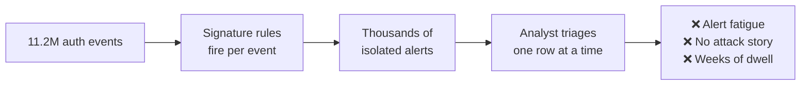
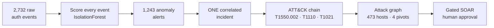
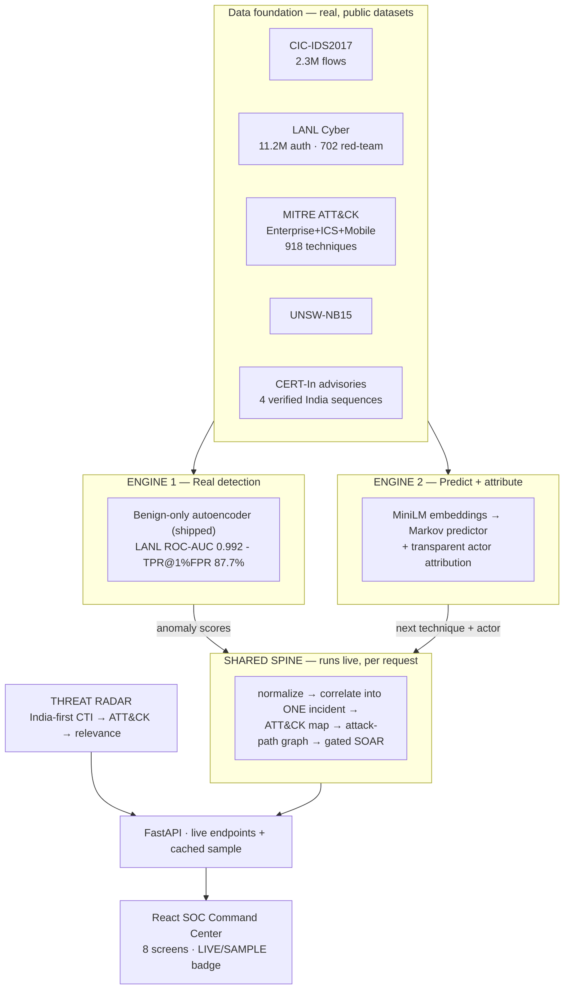
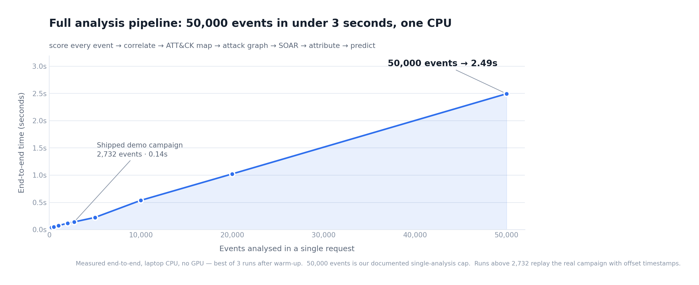
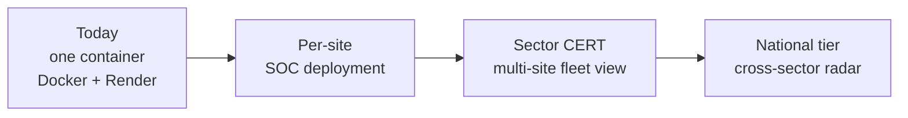

# nextATT&CKs — Pitch Deck Content (10 slides)

> **Living document — update every working session.** Last updated: 2026-07-19.
>
> **How to use:** each `## Slide N` block is one slide. Copy the title, body and speaker
> notes straight into PowerPoint / Google Slides / Gamma. Mermaid blocks render at
> [mermaid.live](https://mermaid.live) → export PNG → paste. `📸 SCREENSHOT:` lines say
> exactly which app page to capture.
>
> **The demo is a separate video** — it is deliberately not a slide here.
>
> **Every number is real and traceable** — from `reports/*.md`, `reports/metrics.json`
> and the live analysis cache. Do not round up; the honesty is the differentiator.

---

## Deck at a glance

| # | Slide | Covers | Judging weight it serves |
|---|---|---|---|
| 1 | Title & one-liner | Identity | — |
| 2 | The problem | Problem | Business Impact 25% |
| 3 | Why detection fails today | Problem | Business Impact |
| 4 | Our solution | Solution | Innovation 25% |
| 5 | Features | Features | UX 15% · Innovation |
| 6 | Architecture — overview | Architecture | Technical Excellence 20% |
| 7 | Engine 1 — real detection | Architecture (engine) | Technical Excellence |
| 8 | Engine 2 — predict & attribute | Architecture (engine) | Innovation |
| 9 | Feasibility & scalability | Feasibility | Scalability 15% |
| 10 | Impact, honesty & ask | Impact | Business Impact |

**Weights:** Innovation 25% · Business Impact 25% · Technical Excellence 20% · Scalability 15% · UX 15%.

---

## Slide 1 — Title

**Title:** nextATT&CKs
**Subtitle:** AI-Driven Cyber Resilience for Critical National Infrastructure
**Tag line (large):** *From weeks of attacker dwell time to a correlated incident in minutes.*

**Footer:** ET AI Hackathon 2026 · Problem Statement 7 · Team [NAME] · [DATE]

📸 **SCREENSHOT:** the **Login / splash screen** (`/`) as a faded full-bleed background behind the title.

**Speaker notes:** "A SOC brain for critical national infrastructure. Every screen in our demo runs a live analysis on real red-team data — nothing pre-baked."

---

## Slide 2 — The problem

**Title:** India's critical infrastructure is breached faster than it is defended

| Fact | Number | Source |
|---|---|---|
| Incidents handled by CERT-In (2023) | **1.59 million+** | CERT-In |
| Govt entities on end-of-life IT | **70%+** | PS7 brief |
| Global median attacker dwell time | **~10 days** | Mandiant M-Trends 2024 |
| Real Indian precedents | **AIIMS Delhi ransomware (2022)** · **CBSE breaches (2024, 2026)** | Public reporting |

**Callout (big):** The data to catch these attacks is already in the logs. What's missing is the layer that *connects* it in time.

**Speaker notes:** "AIIMS lost patient systems for days; CBSE lost exam data. Not zero-days — slow, quiet lateral movement inside authentication logs nobody correlated."

---

## Slide 3 — Why detection fails today

**Title:** Three failures, one root cause

| Failure | Why it happens |
|---|---|
| **Low-and-slow evades signatures** | APTs use *valid* credentials — nothing matches a known-bad rule |
| **Alert fatigue** | Every event scored alone; no notion that 1,243 alerts are **one** attack |
| **No blast-radius view** | Analysts see rows, not the path from a workstation to the patient database |

**Speaker notes:** "The signal is there. It's scattered across thousands of individually-boring events."

---

## Slide 4 — Our solution

**Title:** The layer that connects weak signals

**One sentence (center, large):**
> Real anomaly fires → weak signals correlate into **one** incident → each step maps to MITRE ATT&CK → the attack path to the crown jewel lights up → we predict the next move, name the likely actor, and recommend gated containment.

**The funnel, on real data:**

| Spine output (live, LANL campaign) | Value |
|---|---|
| Compromised accounts in one campaign | **104** |
| Attacker pivots | **4** — but **C17693 alone carries 670 of 702 red-team events** |
| Crown jewels reachable | **16** · total exposure **469 hosts** |
| **Isolate one host (C17693)** | **cuts 463 hosts of blast radius** |

**Killer line:** "One machine ran almost the entire campaign. Isolate it, sever 463 hosts."

📸 **SCREENSHOT:** **Attack Graph** (full campaign) — 473-node graph with pivots, crown jewels and the blast-radius panel.

---

## Slide 5 — Features

**Title:** What an analyst actually gets

| Feature | What it does | Real? |
|---|---|---|
| **Analyze any log** | Pick a scenario or **upload your own CSV** — the whole app re-renders on your data | ✅ live per request |
| **Campaign view** | All **104** compromised accounts in one incident, not one victim | ✅ |
| **Per-account drill-down** | Open any account → its own scoped incident, graph and report | ✅ |
| **Attack-path graph** | Click a host to see every authentication; blast radius across **all** pivots | ✅ |
| **Live event scoring** | Score a single auth event on stage with the real IsolationForest | ✅ |
| **Next-technique prediction** | Ranked next moves with a real transition probability (e.g. **52.5%**) | ✅ |
| **Actor attribution** | Ranked ATT&CK group + auditable justification | ✅ transparent retrieval |
| **Threat Radar** | India-first external CTI mapped to ATT&CK, cross-referenced to *your* incident | ✅ live feeds |
| **Audit-ready report** | Download/print incident report for compliance | ✅ |
| **Gated SOAR** | Containment recommendations, critical assets need human approval | ⚠️ simulated by design |

**India scenarios shipped:** AIIMS-style hospital ransomware · CBSE-style exam-board breach (synthetic logs, labelled, styled after real reported incidents).

📸 **SCREENSHOT:** **Threat Radar** — feed-status chips + a cross-referenced hit showing "Where you're exposed".

---

## Slide 6 — Architecture (overview)

**Title:** Two engines, one spine, one live pipeline

**Stack:** Python 3.10 · scikit-learn · networkx · sentence-transformers (build-time) · FastAPI · React 19 + Vite · Docker (one container, **no GPU at runtime**).

**Speaker notes:** "Two engines feed a shared spine. The spine runs per request — that's why uploading your own log works."

---

## Slide 7 — Engine 1: real detection

**Title:** Unsupervised detection, scored against real red-team ground truth

| Dataset | Metric | Result | Note |
|---|---|---|---|
| **LANL** (the moat) | **ROC-AUC** | **0.992** | vs **702 real red-team events** |
| LANL | TPR @ 5% FPR | **96.6%** | 678 / 702 caught |
| LANL | TPR @ 1% FPR | 87.7% | strict operating point |
| LANL | Behavioural-only ROC (NTLM ablated) | **0.906** | not a protocol crutch |
| CIC-IDS2017 | PR-AUC (autoencoder) | **0.570** | best model |
| CIC-IDS2017 | PR-AUC (IsolationForest) | 0.473 | **3.1× random**, **4.8× rule** |
| UNSW-NB15 | ROC-AUC | **0.829** | 2nd benchmark, official split |

**7 behavioural features — no signatures:** new-destination-for-user · new-source-for-user · running fan-out · cumulative fail-rate · destination rarity · is-fail · is-NTLM.

**Callout:** ⚠️ **We never report accuracy.** At 0.006% prevalence an "always benign" guess scores 99.99% and catches zero attacks. We headline **PR-AUC** and **TPR @ fixed FPR**. The naive volumetric rule is *worse than random* (ROC 0.25) — we report that too.

📸 **SCREENSHOT:** **Models & Metrics** — Engine 1 cards (LANL / CIC-IDS2017 / UNSW). Optional: `reports/pr_curve_cicids.png`.

---

## Slide 8 — Engine 2: predict & attribute

**Title:** What comes next — and who is doing it

**A. Next-technique prediction**

| Method | Top-3 accuracy |
|---|---|
| Most-frequent baseline | 4.9% |
| Kill-chain-order baseline ⚠️ | 7.1% |
| LSTM over MiniLM embeddings | 27.2% |
| **Markov 1st-order — SHIPPED** | **38.1%** |

**Anti-circularity proof (say it out loud):** our sequences are ordered by a kill-chain heuristic, so a model could cheat by re-learning that ordering. **Markov beats the kill-chain baseline 5.4×** → it learns *real* technique-to-technique transitions.
**Honest negative result:** the LSTM **lost** to Markov at this data scale — so we shipped Markov. Honest > fancy.

**B. Actor attribution** — transparent profile retrieval over **172 ATT&CK groups**: coverage (55%) + Jaccard (20%) + semantic similarity (25%), with a printed justification. **Not** a trained classifier — and we say so.

**C. Live confidence** — `/predict-next` returns a true first-order transition probability (e.g. `T1566.001 → T1566.002 @ 52.5%`).

**D. Non-circular India test** — **4/4 analyst-verified CERT-In advisories**, report-ordered: top-3 **10.0%** vs 38.1% on heuristic-ordered sets. Real orderings are harder — we publish both.

📸 **SCREENSHOT:** **Threat Intel & Attribution** — technique mapping, ranked actors, predict-next widget with % scores.

---

## Slide 9 — Feasibility & scalability

**Title:** Built, deployed, and ready to grow

> **Put this chart on the slide:** `reports/scaling_chart.png` (dark-deck version: `reports/scaling_chart_dark.png`).
> Measured, not asserted — regenerate any time with `./.venv/Scripts/python.exe -m scripts.make_scaling_chart`.
> Raw numbers land in `reports/scaling_measurements.json`.

**What the chart proves:** the *full* pipeline (score → correlate → ATT&CK map → attack graph → SOAR → attribute → predict) on one laptop CPU, no GPU:

| Events in one request | End-to-end | Alerts raised |
|---|---|---|
| 2,732 (shipped demo campaign) | **0.14 s** | 1,243 |
| 10,000 | 0.54 s | 4,202 |
| 20,000 | 1.02 s | 8,090 |
| 50,000 (our documented cap) | **2.49 s** | 20,185 |

Best of 3 runs after warm-up. Runs above 2,732 replay the real campaign with offset timestamps. Cost per event stays flat to 20k and rises only mildly at the cap — so the 50k ceiling below is a deliberate design boundary, not a wall we hit.

| Property | Evidence |
|---|---|
| **Runs anywhere** | One Docker container, **no GPU at runtime**, slim deps (no torch) |
| **Streaming ingestion** | LANL prep **streams 519M lines** without full decompression |
| **Schema-agnostic input** | 12-field schema + **column-alias resolution** (`username`/`src`/`dst` all work) |
| **Model-light serving** | Embeddings precomputed; runtime unpickles sklearn + Markov only |
| **Engineering rigour** | **29 automated tests** · browser E2E **14/15 flows** · `docker build` verified |
| **Metric integrity** | Eval scripts write `reports/metrics.json`; the UI reads it — **drift impossible** |

**Honest limit:** graph analytics are in-memory networkx — fine to ~50k events per analysis (measured above at 2.49 s). Beyond that: shard by tenant/time window, or move to a graph DB. We know the next step.

**Roadmap:** 30 days — SIEM connectors (Splunk/ELK/Wazuh) · 90 days — OT/ICS coverage, graph DB · 6 months — sector-CERT fleet view, real SOAR behind change control.

---

## Slide 10 — Impact, honesty & ask

**Title:** What changes for an Indian CNI operator

| Dimension | Today | With nextATT&CKs |
|---|---|---|
| **Detection** | ~10-day median dwell | First correlated alert within the log window |
| **Analyst load** | 1,243 alerts to triage | **1 incident** with a narrative |
| **Containment** | "Which of 473 hosts?" | **Isolate 1 → cut 463** |
| **Attribution** | Manual CTI reading | Ranked actor + auditable justification |
| **External intel** | Separate portal | Cross-referenced to *your* techniques |

**Who benefits:** hospitals (AIIMS-class) · exam boards (CBSE-class) · grid operators · the **70%+ of govt entities on end-of-life IT** — those least able to staff a 24/7 SOC.
**No new sensors required** — we make the logs they already collect tell the story.

**Our four honesty rules (ask us about any):**
1. **No accuracy theatre** — PR-AUC / TPR@FPR only.
2. **Always show baseline lift** — baselines built first; we report when a baseline beats us.
3. **Anti-circularity, out loud** — Markov 5.4× the kill-chain baseline; the LSTM lost and we shipped the simpler model.
4. **Nothing fabricated on screen** — every number traces to the live analysis or a labelled citation.

**Real vs simulated (stated up front):** detection, correlation, ATT&CK mapping, graph, attribution and prediction are **real**. SOAR containment and sector alerts are **simulated + human-gated** — there is no live network to isolate hosts on. India scenarios are **synthetic logs** styled after real incidents, labelled in the UI.

**The ask:** a pilot dataset from one Indian CNI operator — hospital, exam board or grid — to validate on their real telemetry.

**Closing line:** *"The logs already know. We built the layer that listens."*

**Links:** GitHub `[REPO URL]` · Live demo `[RENDER URL]` · Demo video `[LINK]`

---

# Asset checklist

| Asset | Source | Slide |
|---|---|---|
| Login splash screenshot | `/` | 1 |
| Failure-chain diagram PNG | Mermaid, Slide 3 | 3 |
| Funnel diagram PNG | Mermaid, Slide 4 | 4 |
| Attack Graph screenshot | `/graph` (full campaign) | 4 |
| Threat Radar screenshot | `/threat-radar` | 5 |
| Architecture diagram PNG | Mermaid, Slide 6 | 6 |
| Models & Metrics screenshot | `/metrics` | 7 |
| PR-curve image (optional) | `reports/pr_curve_cicids.png` | 7 |
| Threat Intel screenshot | `/threat-intel` | 8 |
| Scalability diagram PNG | Mermaid, Slide 9 | 9 |
| **Pipeline scaling chart** | `reports/scaling_chart.png` (dark: `_dark.png`) — ready to drop in | 9 |

**Screenshot tips:** present in **dark mode** (graph + severity colours pop hardest) · make sure the topbar shows **LIVE ANALYSIS** in every post-analysis capture — that badge *is* the proof · crop out browser chrome and bookmarks.

---

# Design notes

- **Palette:** deep navy/charcoal background, one accent blue (`#4C8DFF`); red reserved **only** for genuine severity — never decoration.
- **Typography:** one clean sans for prose; **monospace for every identifier** (C17693, T1550.002, U66@DOM1) — it's the product's signature and reads as "real system".
- **Density:** one idea per slide. Split any table over ~6 rows across two columns if cramped.
- **Numbers:** big and bare (`0.992`, `1,243 → 1`, `463`). Let them carry the slide.
- **Do not** use stock hacker imagery (hoodies, matrix code). The screenshots are the credibility.

---

# Q&A backup (keep as hidden slides / notes — not part of the 10)

**"Isn't 100% attribution overfitting?"** Yes — the built-in eval retrieves a public profile from a piece of itself, which is near-trivial by construction. We never headline it; in the demo we observe 3–4 techniques, and it's transparent retrieval with a printed justification, not a classifier.

**"Why only 3 ATT&CK techniques?"** LANL is **authentication logs only** — no process/file/network telemetry. Auth behaviour honestly evidences pass-the-hash, brute force and remote services. We refuse to invent techniques the data can't support; richer telemetry deepens the chain automatically.

**"Your India sequences score only 10% — bad?"** It's the honest number and it proves the method: real report-ordered timelines are *harder* than heuristic-ordered ones, which shows our 38.1% was partly ordering-driven. Prediction is a supporting feature; we lean on Engine 1 + correlation.

**"How do you know the crown jewels are critical?"** We don't claim ground truth — LANL is anonymised with no criticality labels. We derive them from a stated heuristic (hosts the most distinct accounts authenticate to). The red team reached **13 of the top-20**, including one **17,808 accounts** depend on. In production the operator supplies the CMDB list — it's already an input.

**"What if the live system fails?"** Cached sample = a real analysis of a shipped log (identical pipeline, no network); live widgets degrade to a deterministic result with a visible "○ cached" badge; Threat Radar ships a committed cache.
