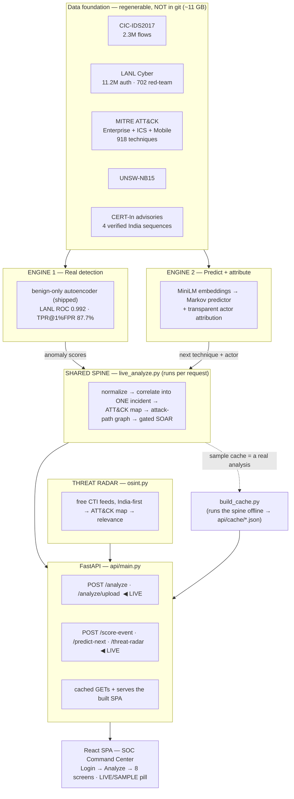

# Resilience Graph AI

**ET AI Hackathon 2026 · PS7 — AI-Driven Cyber Resilience for Critical National Infrastructure**

> Detect low-and-slow attacks in real infrastructure logs, connect weak signals into an
> explainable MITRE ATT&CK attack chain, predict the attacker's next moves, name the likely
> actor, cross-reference live external threat intel, and recommend gated containment —
> cutting detection time from weeks to minutes.

An AI-augmented **SOC Command Center**: a FastAPI backend + React SPA where every screen
renders a **live analysis** of an event log you choose or upload — no hardcoded demo data.

---

## Quick start (new device, ~5 min)

**The app runs from a fresh clone with no dataset download.** Models, ATT&CK lookups,
embeddings, demo scenarios and the sample cache are all committed, so teammates can run the
whole thing without the ~11 GB of raw data.

### Prerequisites
- **Python 3.10+** (3.10.11 recommended) — `python --version`
- **Node.js 20+** and npm — `node --version`
- **git**

### 1. Clone
```bash
git clone https://github.com/RishiiGamer2201/resilience-graph-ai.git
cd resilience-graph-ai
```

### 2. Backend (FastAPI)
Create a virtual environment and install the **slim runtime deps** (enough to run the app —
no torch, no 11 GB download):

**Windows (PowerShell):**
```powershell
python -m venv .venv
.\.venv\Scripts\Activate.ps1
pip install -r requirements-deploy.txt
python -m uvicorn api.main:app --port 8000
```

**macOS / Linux:**
```bash
python3 -m venv .venv
source .venv/bin/activate
pip install -r requirements-deploy.txt
python -m uvicorn api.main:app --port 8000
```

Backend is up when `http://127.0.0.1:8000/api/health` returns `{"ok":true,"cache_built":true}`.

### 3. Frontend (React + Vite) — in a second terminal
```bash
cd frontend
npm install          # first time only
npm run dev          # → http://localhost:5173
#   npm run dev -- --host   # to open it from other devices on your Wi-Fi
```

### 4. Open it
Go to **http://localhost:5173** → **Enter demo environment** → **Analyze Log** →
pick a scenario (e.g. *LANL red-team campaign* or *AIIMS-style hospital ransomware*) and hit
**Analyze**. The whole app now shows that live analysis (topbar flips to **LIVE ANALYSIS**).

> **One-container alternative (Docker):** `docker build -t resilience-graph-ai . && docker run --rm -p 8000:8000 resilience-graph-ai` → open **http://localhost:8000**. This is exactly what deploys to Render.

---

## Architecture



Full detail (folder tree, request topology, tech-stack table): **[architecture.md](architecture.md)**.

---

## What it does

| Engine | Scores | What it does |
|---|---|---|
| **Engine 1 — Real Detection** | Technical Excellence | Unsupervised anomaly / lateral-movement detection on **real data** (CIC-IDS2017, LANL, UNSW-NB15), scored against LANL's red-team ground truth (ROC-AUC **0.992**, TPR **87.7%** at 1% FPR) |
| **Engine 2 — Prediction + Attribution** | Innovation | Predicts the attacker's next ATT&CK technique (Markov, **5.4×** the kill-chain baseline) and ranks the likely actor by transparent profile retrieval |

Both feed a **shared spine** that runs live per request: normalize → correlate into one
incident → ATT&CK map → attack-path graph (choke points, blast radius across all pivots) →
confidence-gated SOAR. A **Threat Radar** pulls India-first external CTI (CISA KEV, ET CISO,
security RSS) and cross-references it with your incident.

### Try these
- **Prove it's live:** on *Analyze Log*, download the synthetic **sample bank incident CSV** and upload it — a fictional estate (nothing like LANL) the pipeline analyses end-to-end.
- **India scenarios:** *AIIMS-style hospital ransomware* and *CBSE-style exam-board breach*.
- **Attackers:** open any of the 104 compromised accounts → its own scoped incident.

---

## Rebuilding from raw data (optional — only to retrain / regenerate)

You **don't** need this to run the app. Do it only to re-run the ML pipeline.

1. Install the **full** deps: `pip install -r requirements.txt` (adds torch, sentence-transformers, pyarrow…).
2. Download the datasets (~11 GB) — easiest is the mirrored bundle:
   **[ET HACK DATASET (Kaggle)](https://kaggle.com/datasets/c3c7d72d2098d35857c2136a6d1c35785b7ba94e0f48ed6de68d0ab1ed021945)** — unzip into `data/raw/` per **[data/README.md](data/README.md)**.
3. Regenerate (each script writes a report to `reports/`):
   ```bash
   python -m src.engine1.prep_cicids   &&  python -m src.engine1.anomaly
   python -m src.engine1.prep_lanl     &&  python -m src.engine1.lanl_detect
   python -m src.shared.parse_attack                     # ATT&CK lookups (Ent+ICS+Mobile)
   python -m src.engine2.build_embeddings               # MiniLM embeddings (CPU: CUDA_VISIBLE_DEVICES="")
   python -m src.engine2.build_sequences && python -m src.engine2.build_predictor
   python -m scripts.export_demo_events && python -m scripts.make_india_scenario
   python -m scripts.build_cache                          # regenerate api/cache/*.json
   ```

| Dataset | Use | Source |
|---|---|---|
| CIC-IDS2017 | anomaly detection + metrics | unb.ca/cic/datasets/ids-2017.html |
| LANL Cyber | lateral movement + red-team ground truth | csr.lanl.gov/data/cyber1 |
| MITRE ATT&CK (Enterprise + ICS + Mobile) | mapping, sequences, attribution, radar | github.com/mitre-attack/attack-stix-data |
| UNSW-NB15 | second benchmark | research.unsw.edu.au/projects/unsw-nb15-dataset |
| CERT-In advisories | verified India sequences | cert-in.org.in |

---

## Testing

```bash
python -m pytest tests/ -q          # 27 tests: live pipeline + OSINT
cd frontend && npm run build        # frontend must build clean
```

---

## Project docs

| Doc | Purpose |
|---|---|
| [prd.md](prd.md) | What we're building, users, features |
| [architecture.md](architecture.md) | Full architecture (mermaid, folder tree, tech stack) |
| [rules.md](rules.md) | What to use / avoid; ML-honesty rules |
| [phases.md](phases.md) | Phase-by-phase status |
| [design.md](design.md) | Design tokens, palette, components |
| [memory.md](memory.md) | Living project state + session log |
| [research/claude/](research/claude/) | Canonical build spec, decision memo, plans |

## Team & workflow
Work on feature branches (`git checkout -b m2/anomaly-baseline`), open PRs into `main`.

---
*Not affiliated with ET Edge / MITRE / CERT-In. Uses public datasets under their respective licenses. Response actions are simulated and human-gated; attribution is transparent profile retrieval, not a trained classifier.*
