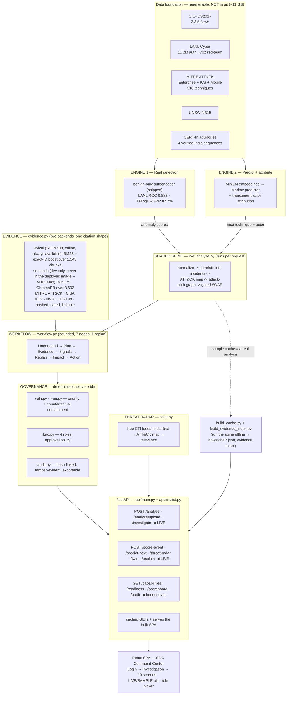

# nextATT&CKs

**ET AI Hackathon 2026 · PS7 — AI-Driven Cyber Resilience for Critical National Infrastructure**

> Detect low-and-slow attacks in real infrastructure logs, connect weak signals into an
> explainable MITRE ATT&CK attack chain, predict the attacker's next moves, name the likely
> actor, cross-reference live external threat intel, and recommend gated containment.
> On the shipped synthetic scenarios the first correlated alert lands 2 hours into
> the log; the "weeks" it is compared against is a cited Mandiant dwell median,
> not something we measured.

An AI-augmented **SOC Command Center**: a FastAPI backend + React SPA where every screen
renders a **live analysis** of an event log you choose or upload — no hardcoded demo data.

**Links:** [Live demo](https://resilience-graph-ai.onrender.com) · [Demo video](https://youtu.be/vouw0dOcj2k) · [Presentation (Canva)](https://canva.link/f4gesmsduelihuz)

---

## Quick start (new device, ~5 min)

**The app runs from a fresh clone with no dataset download.** Models, ATT&CK lookups,
embeddings, demo scenarios and the sample cache are all committed, so teammates can run the
whole thing without the ~11 GB of raw data.

### Prerequisites
- **Python 3.10+** (3.10.11 recommended) — `python --version`
- **Node.js 20+** and npm — `node --version`
- **git**

### 1. Clone
```bash
git clone https://github.com/RishiiGamer2201/resilience-graph-ai.git
cd resilience-graph-ai
```

### 2. Backend (FastAPI)
Create a virtual environment and install the **slim runtime deps** (enough to run the app —
no torch, no 11 GB download):

**Windows (PowerShell):**
```powershell
python -m venv .venv
.\.venv\Scripts\Activate.ps1
pip install -r requirements-deploy.txt
python -m uvicorn api.main:app --port 8001
```

**macOS / Linux:**
```bash
python3 -m venv .venv
source .venv/bin/activate
pip install -r requirements-deploy.txt
python -m uvicorn api.main:app --port 8001
```

Backend is up when `http://127.0.0.1:8001/api/health` returns `{"ok":true,"cache_built":true}`.
Vite proxies `/api` to this port by default; set `NEXTATTACK_DEV_API` to override it.

### 3. Frontend (React + Vite) — in a second terminal
```bash
cd frontend
npm install          # first time only
npm run dev          # → http://localhost:5173
#   npm run dev -- --host   # to open it from other devices on your Wi-Fi
```

The access screen uses the repository-owned WebGL topology by default. To use a
project Spline scene, set `VITE_SPLINE_SCENE_URL` to your `.splinecode` URL; the
scene is decorative and safely falls back if it cannot load.

When the backend uses `NEXTATTACK_ROLE_TOKENS`, enter the matching token on the
access screen. It stays in memory and is sent on both regular and streaming API
requests; it is never persisted by the frontend.

### 4. Open it
Go to **http://localhost:5173** → **Enter demo environment** → **Investigation** →
press **Run investigation**. The default scenario is an AIIMS-style hospital
ransomware campaign; the seven-stage rail fills with real per-node timings and the
whole app switches to that live analysis (topbar flips to **LIVE ANALYSIS**).

**Zero credentials.** No API key, no account, no database, no network. Check it
yourself: `GET /api/capabilities` reports `keys_required: []` and names the live
state of every optional component.

> **One-container alternative (Docker):** `docker build -t resilience-graph-ai . && docker run --rm -p 8000:8000 resilience-graph-ai` → open **http://localhost:8000**. This is exactly what deploys to Render.

---

## Architecture


```mermaid
flowchart TB
  subgraph DATA["Data foundation — regenerable, NOT in git (~11 GB)"]
    CIC["CIC-IDS2017<br/>2.3M flows"]
    LANL["LANL Cyber<br/>11.2M auth · 702 red-team"]
    ATTACK["MITRE ATT&CK<br/>Enterprise + ICS + Mobile<br/>918 techniques"]
    UNSW["UNSW-NB15"]
    CERTIN["CERT-In advisories<br/>4 verified India sequences"]
  end

  subgraph E1["ENGINE 1 — Real detection"]
    IF["benign-only autoencoder (shipped)<br/>LANL ROC 0.992 · TPR@1%FPR 87.7%"]
  end
  subgraph E2["ENGINE 2 — Predict + attribute"]
    PRED["MiniLM embeddings → Markov predictor<br/>+ transparent actor attribution"]
  end

  DATA --> E1
  DATA --> E2

  subgraph SPINE["SHARED SPINE — live_analyze.py (runs per request)"]
    S["normalize -> correlate into incidents -><br/>ATT&CK map -> attack-path graph -> gated SOAR"]
  end
  E1 -- "anomaly scores" --> SPINE
  E2 -- "next technique + actor" --> SPINE

  subgraph RADAR["THREAT RADAR — osint.py"]
    FEEDS["free CTI feeds, India-first → ATT&CK map → relevance"]
  end

  subgraph EV["EVIDENCE — evidence.py (two backends, one citation shape)"]
    IDX["lexical (SHIPPED, offline, always available): BM25 + exact-ID boost over 1,545 chunks<br/>semantic (dev only, never in the deployed image -- ADR 0008): MiniLM + ChromaDB over 3,692<br/>MITRE ATT&CK · CISA KEV · NVD · CERT-In · hashed, dated, linkable"]
  end

  subgraph GOV["GOVERNANCE — deterministic, server-side"]
    G1["vuln.py · twin.py — priority + counterfactual containment"]
    G2["rbac.py — 4 roles, approval policy"]
    G3["audit.py — hash-linked, tamper-evident, exportable"]
  end

  subgraph WF["WORKFLOW — workflow.py (bounded, 7 nodes, 1 replan)"]
    W["Understand → Plan → Evidence → Signals → Replan → Impact → Action"]
  end

  SPINE --> WF
  EV --> WF
  WF --> GOV
  RADAR --> API
  GOV --> API
  BUILD["build_cache.py + build_evidence_index.py<br/>(run the spine offline → api/cache/*.json, evidence index)"]
  SPINE -. "sample cache = a real analysis" .-> BUILD
  BUILD --> API

  subgraph API["FastAPI — api/main.py + api/finalist.py"]
    A1["POST /analyze · /analyze/upload · /investigate  ◀ LIVE"]
    A2["POST /score-event · /predict-next · /threat-radar · /twin · /explain  ◀ LIVE"]
    A3["GET /capabilities · /readiness · /scoreboard · /audit  ◀ honest state"]
    A4["cached GETs + serves the built SPA"]
  end

  API --> SPA["React SPA — SOC Command Center<br/>Login → Investigation → 10 screens · LIVE/SAMPLE pill · role picker"]
```

**No LLM is in any decision path.** Every score, ranking, gate, path and hash is
deterministic Python. `LLM_PROVIDER` is `none` and `/api/capabilities` says so.
Design decisions and the alternatives we rejected: **[docs/architecture/adr/](docs/architecture/adr/)**.

Full detail (folder tree, request topology, tech-stack table): **[architecture.md](architecture.md)**.

---

## What it does

| Engine | Scores | What it does |
|---|---|---|
| **Engine 1 — Real Detection** | Technical Excellence | Unsupervised anomaly / lateral-movement detection on **real data** (CIC-IDS2017, LANL, UNSW-NB15), scored against LANL's red-team ground truth (ROC-AUC **0.992**, TPR **87.7%** at 1% FPR) |
| **Engine 2 — Prediction + Attribution** | Innovation | Predicts the attacker's next ATT&CK technique (interpolated Markov, top-3 **38.1%**, **5.4×** the kill-chain baseline) and ranks the likely actor by transparent profile retrieval |

Both feed a **shared spine** that runs live per request: normalize → correlate alerts into
incidents → ATT&CK map → attack-path graph (choke points, blast radius across all pivots) →
confidence-gated SOAR. A **Threat Radar** pulls India-first external CTI (CISA KEV, ET CISO,
security RSS) and cross-references it with your incident.

On top of that spine, the finalist surface adds **cited evidence** for every ATT&CK
conclusion, **vulnerability prioritisation** that combines CISA KEV with reachability
in *your* attack graph, a **digital twin** that costs a containment before you take it,
**server-side RBAC** with human approval, and a **tamper-evident audit chain**.

### Try these
- **Prove the human gate is real:** on *Investigation*, set the top-bar role to
  **Analyst** and approve a crown-jewel action. The server returns 403. Switch to
  **Responder** and approve with no reason: 422.
- **Prove the audit chain is real:** press **Prove tamper-evidence**. We export it,
  edit a record in your browser, send it back, and the server names the altered record.
- **Prove it's live:** on *Analyze Log*, download the synthetic **sample bank incident CSV** and upload it — a fictional estate (nothing like LANL) the pipeline analyses end-to-end.
- **India scenarios:** *AIIMS-style hospital ransomware* and *CBSE-style exam-board breach*.
- **Attackers:** open any of the 104 compromised accounts → its own scoped incident.

---

## Rebuilding from raw data (optional — only to retrain / regenerate)

You **don't** need this to run the app. Do it only to re-run the ML pipeline.

1. Install the **full** deps: `pip install -r requirements.txt` (adds torch, sentence-transformers, pyarrow…).
2. Download the datasets (~11 GB) — easiest is the mirrored bundle:
   **[ET HACK DATASET (Kaggle)](https://kaggle.com/datasets/c3c7d72d2098d35857c2136a6d1c35785b7ba94e0f48ed6de68d0ab1ed021945)** — unzip into `data/raw/` per **[data/README.md](data/README.md)**.
3. Regenerate (each script writes a report to `reports/`):
   ```bash
   python -m src.engine1.prep_cicids   &&  python -m src.engine1.anomaly
   python -m src.engine1.prep_lanl     &&  python -m src.engine1.lanl_detect
   python -m src.shared.parse_attack                     # ATT&CK lookups (Ent+ICS+Mobile)
   python -m src.engine2.build_embeddings               # MiniLM embeddings (CPU: CUDA_VISIBLE_DEVICES="")
   python -m src.engine2.build_sequences && python -m src.engine2.build_predictor
   python -m scripts.export_demo_events && python -m scripts.make_india_scenario
   python -m scripts.build_evidence_index                 # cited-evidence corpus (--no-network works)
   python -m scripts.build_cache                          # regenerate api/cache/*.json
   python -m scripts.eval_ps7 && python -m scripts.eval_retrieval   # regenerate the scoreboard
   ```

| Dataset | Use | Source |
|---|---|---|
| CIC-IDS2017 | anomaly detection + metrics | unb.ca/cic/datasets/ids-2017.html |
| LANL Cyber | lateral movement + red-team ground truth | csr.lanl.gov/data/cyber1 |
| MITRE ATT&CK (Enterprise + ICS + Mobile) | mapping, sequences, attribution, radar | github.com/mitre-attack/attack-stix-data |
| UNSW-NB15 | second benchmark | research.unsw.edu.au/projects/unsw-nb15-dataset |
| CERT-In advisories | verified India sequences | cert-in.org.in |

---

## The PS7 surface

| Screen | What it does |
|---|---|
| **Investigation** | The three-minute hero. Seven bounded stages — Understand → Plan → Evidence → Signals → Replan → Impact → Action — with the headline pair (attack progression confidence, crown-jewel exposure) and the arithmetic behind each number one click away. Cited evidence, a counterfactual containment with its operational cost, a prioritised vulnerability queue, a human-gated approval, and a tamper-evident audit chain you can break on purpose. |
| **PS7 Scoreboard** | Every metric with its definition, dataset, baseline and the report that produced it — read from `reports/metrics.json`, never typed into the UI. Two metrics render **Not measured** with the reason. |
| Overview · Attackers · Live Incident · Attack Graph · Threat Intel · Threat Radar · Models & Metrics · Data & Methodology | The original SOC screens, all rendering whatever analysis you ran. |

Nothing is ever executed against a real system. Every response action is simulated,
and the scoreboard reports the measured count: zero.

## Testing and verification

One command tells you whether the repo is demo-ready:

```powershell
.\scriptserify.ps1              # artifacts, Dockerfile, tests, self-checks, lint, build, API smoke
.\scriptserify.ps1 -Docker      # additionally build the image and smoke-test the container
```

POSIX: `bash scripts/verify.sh [--docker]`. Every skipped step says why it skipped.

Or the pieces:

```bash
python -m pytest tests/ -q          # 134 tests, no network required
python -m scripts.eval_ps7          # regenerate the PS7 operational metrics
python -m scripts.eval_retrieval    # regenerate the retrieval gold-set results
python -m scripts.audit_stale       # fail if any doc cites an out-of-date number
cd frontend && npm run build        # frontend must build clean
```

---

## Project docs

| Doc | Purpose |
|---|---|
| [prd.md](prd.md) | What we're building, users, features |
| [architecture.md](architecture.md) | Full architecture (mermaid, folder tree, tech stack) |
| [rules.md](rules.md) | What to use / avoid; ML-honesty rules |
| [phases.md](phases.md) | Phase-by-phase status |
| [design.md](design.md) | Design tokens, palette, components |
| [memory.md](memory.md) | Living project state + session log |
| [research/claude/](research/claude/) | Canonical build spec, decision memo, plans |
| **[docs/](docs/)** | **Architecture decisions, threat model, evaluation methodology, cost ledger, runbook, demo script, judge Q&A — start at [docs/README.md](docs/README.md)** |
| [CONTRIBUTING.md](CONTRIBUTING.md) | Setup, working rules, how to add a metric |
| [SECURITY.md](SECURITY.md) | What we guarantee, and what we do not |

## Team & workflow
Work on feature branches (`git checkout -b m2/anomaly-baseline`), open PRs into `main`.

---
*Not affiliated with ET Edge / MITRE / CERT-In. Uses public datasets under their respective licenses. Response actions are simulated and human-gated; attribution is transparent profile retrieval, not a trained classifier.*
