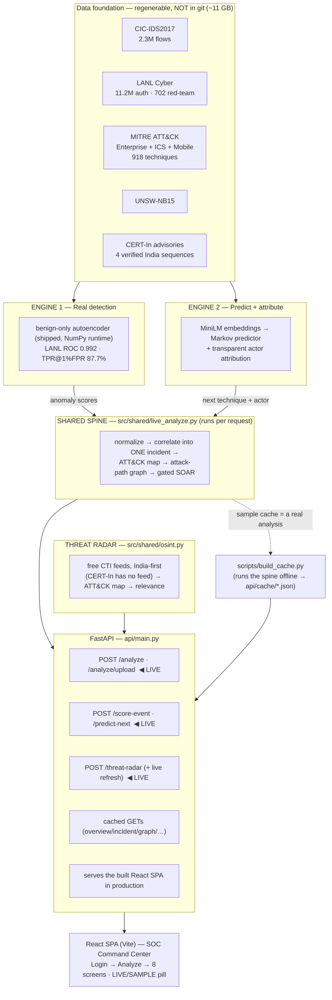
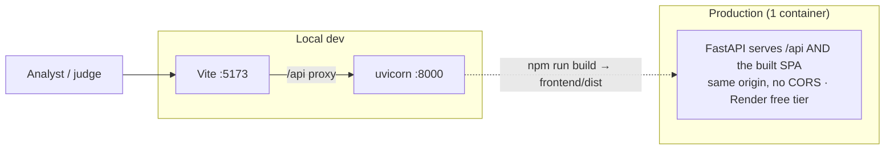

# Architecture — nextATT&CKs

> **Living document — update every working session.** Last updated: 2026-07-16.

## System at a glance



**Key principle — genuinely live, honestly labelled.** `POST /api/analyze` runs the *entire* spine on whatever event log you give it (a shipped scenario or an uploaded CSV). The cached `GET` endpoints serve a **sample that is itself a real analysis** of a shipped LANL red-team log — built by `build_cache.py` calling the same `analyze_events`. Nothing on screen is fabricated: every number traces to the current analysis bundle or a labelled citation. The topbar pill shows **LIVE ANALYSIS** vs **SAMPLE DATA** at all times.

## Request topology



- **Local dev:** two processes — uvicorn on :8000, Vite on :5173 (proxies `/api` → :8000).
- **Production:** one Docker container — FastAPI serves both `/api` and the built SPA. Deployed via `render.yaml`. Slim deps only (`requirements-deploy.txt`: fastapi, uvicorn, scikit-learn 1.7.2, numpy, joblib, pandas, networkx, python-multipart — **no torch**; embeddings ship as a precomputed pkl).
- **Runtime artifacts force-added to git** (past `.gitignore`) so the app runs from a fresh clone with no data download: `models/iforest_lanl.joblib`, `models/next_technique_markov.pkl`, `data/processed/mitre_attack/attack_lookups.pkl`, `data/processed/engine2/technique_embeddings.pkl`, `data/demo/scenarios/*.csv`, `api/cache/*.json`.

## The 8 screens

| Screen | Shows | Live? |
|---|---|---|
| **Analyze Log** | pick a scenario / upload a CSV → runs the full pipeline | ✅ drives everything |
| **Overview** | MTTD, active incident, detector benchmarks (model-level, fixed) | cached/live |
| **Attackers** | every compromised account in the campaign; open one → its own incident | ✅ per-account analyze |
| **Live Incident** | event-by-event replay + live event scoring + audit-ready report | ✅ `/score-event`, SSE stream |
| **Attack Graph** | host graph, click a host, account filter, focused exposure subgraphs | ✅ per-account analyze |
| **Threat Intel & Attribution** | ATT&CK mapping + ranked actor + live next-technique | ✅ `/predict-next` |
| **Threat Radar** | India-first external CTI → ATT&CK → cross-referenced with your incident; simulated gated alerts | ✅ `/threat-radar` |
| **Models & Metrics · Data & Methodology** | evidence tables (drift-proof) + datasets + honesty notes | cached |

## Folder and file structure

```
ET_HACK_26/
├── api/
│   ├── main.py                 # FastAPI: cached GETs + live /analyze,/score-event,/predict-next,/threat-radar + SPA
│   └── cache/*.json            # sample payloads = a real analysis of the shipped log (committed)
├── scripts/
│   ├── build_cache.py          # rebuilds the sample cache by running analyze_events on the campaign scenario
│   ├── export_demo_events.py   # real LANL logs + derived crown jewels → data/demo/scenarios/
│   ├── make_india_scenario.py  # AIIMS + CBSE synthetic India scenarios
│   └── make_sample_upload.py   # synthetic bank incident (upload-to-prove-it's-live)
├── tests/                      # test_live_analyze.py, test_osint.py
├── src/
│   ├── schema.py               # 12-field common event schema (single source of truth)
│   ├── engine1/                # prep_{cicids,lanl,unsw} · anomaly · lanl_detect · eval_unsw
│   ├── engine2/                # build_{sequences,embeddings,predictor} · attribution
│   └── shared/
│       ├── parse_attack.py     # ATT&CK STIX (Ent+ICS+Mobile) → attack_lookups.pkl
│       ├── correlate.py        # alerts → ONE incident
│       ├── attack_mapper.py    # event → ATT&CK technique (no hallucinated IDs)
│       ├── attack_graph.py     # networkx graph; blast radius / choke points across ALL pivots
│       ├── soar.py             # gated response actions
│       ├── views.py            # `full` incident → per-screen payloads + computed MTTD
│       ├── live_analyze.py     # analyze_events(): the whole spine, per request (LIVE)
│       ├── osint.py            # Threat Radar: free CTI feeds → ATT&CK → relevance (India-first)
│       ├── metrics_store.py    # reports/metrics.json read/write — drift-proof metrics
│       └── timeutil.py         # IST timestamps (fixed +5:30, no tzdata needed)
├── frontend/                   # Vite + React 19 SPA
│   └── src/
│       ├── api.js              # API client + live→cached fallback
│       ├── lib/analysis.jsx    # AnalysisProvider + useScreenData (live bundle overrides sample)
│       ├── components/         # Layout, Sidebar, Topbar, Card, widgets, IncidentReport
│       └── screens/            # Login, Analyze, Overview, Attackers, Incident, Graph, ThreatIntel, ThreatRadar, Metrics, Methodology
├── data/
│   ├── raw/                    # datasets, gitignored (~11 GB) — see data/README.md
│   ├── processed/              # gitignored except attack_lookups.pkl + technique_embeddings.pkl (force-added)
│   ├── demo/scenarios/*.csv    # committed real + synthetic scenarios for /api/analyze
│   └── manual/                 # verified CERT-In sequences + guide
├── models/                     # gitignored; lanl iforest + markov force-added for deploy
├── reports/                    # eval reports (md) + metrics.json (canonical metrics)
├── Dockerfile · render.yaml    # single-container deploy, Render blueprint
├── requirements.txt            # full pipeline deps (torch, pandas, sentence-transformers…)
└── requirements-deploy.txt     # slim API-only deps (no torch)
```

## Tech stack

| Layer | Choice | Why |
|---|---|---|
| ML | scikit-learn (IsolationForest), PyTorch (AE/LSTM comparisons only) | unsupervised benign-only; honest > fancy — Markov/IForest shipped |
| Embeddings | sentence-transformers all-MiniLM-L6-v2 | pretrained, 384-d, shipped as a precomputed pkl (no torch at runtime) |
| Graph | networkx | shortest path, betweenness, reachability |
| Data | pandas + pyarrow (build-time), stdlib CSV (runtime) | streamed LANL extract, day-split CICIDS |
| API | FastAPI + uvicorn | cache + live model endpoints + SSE + SPA |
| CTI | stdlib `urllib` + `xml.etree` | free feeds, zero new deploy deps |
| Frontend | React 19 + Vite 8, react-router 7, recharts, react-force-graph-2d, lucide-react | fast build, lazy-split heavy libs |
| Deploy | Docker (2-stage) on Render free tier | one container, one URL |
| Python | 3.10.11 pinned | library compatibility |
