# Deep research: IT/OT attack detection, progression reasoning, and a cyber-resilience digital twin

**Prepared for:** nextATT&CKs / ET AI Hackathon 2026 PS7<br>
**Research date:** 20 August 2026 (IST)<br>
**Scope:** IT/OT telemetry, OpenTelemetry, OCSF normalization, DNS/VPN/IP/network data, Kafka, behavioral anomaly detection, attack graphs, MITRE ATT&CK, multi-agent investigation, prediction, response approval, AIIMS, CloudSEK, CNCF/LFX, and open-source/cloud deployment.

## Executive conclusion

The defensible answer to the product question—“Is this abnormal, how does it connect to weak signals, where is it in an attack progression, and what should we do now?”—is not one model or one agent. It is an evidence pipeline with four deliberately separate contracts:

1. **Telemetry contract:** collect without losing source semantics or provenance.
2. **Security-event contract:** normalize observations into a versioned OCSF-based schema.
3. **Reasoning contract:** place only supported claims into a temporal graph, linked to ATT&CK/STIX/Attack Flow knowledge.
4. **Decision contract:** compute risk and confidence separately, simulate containment, then apply an explicit approval policy.

OpenTelemetry (OTel) is best used for collection, routing, and observability context; it is not a complete security event taxonomy. OCSF is the canonical security-event layer. STIX 2.1 and MITRE ATT&CK represent threat knowledge, while Attack Flow represents the ordering and branching of adversary behavior. Apache Kafka provides a durable replayable event backbone; Apache Flink CEP or an equivalent stateful stream processor detects time-ordered patterns. A property graph holds entity relationships, findings, and progression hypotheses—not every raw packet or log line.

LLM agents should enrich, retrieve, compare hypotheses, summarize, and draft response plans. Deterministic rules, calibrated statistical models, graph algorithms, policy engines, and human authorization must remain authoritative. Repeating the same evidence through several agents must never increase confidence.

The current nextATT&CKs repository is a credible hackathon implementation of the core idea: deterministic analysis, bounded workflow, an in-process graph, counterfactual containment, evidence retrieval, RBAC, and simulated actions. Its existing ADRs are right for the demo. Production evolution should be a separate deployment profile rather than replacing the working demo stack.

## 1. Standards boundary: what belongs where

| Layer | Recommended standard | Purpose | Important boundary |
|---|---|---|---|
| Collection/transport | OpenTelemetry/OTLP | Receive, process, route, and correlate logs, metrics, traces, profiles, and resource context | OTel semantic conventions are observability-oriented and some DNS/event conventions are still marked development; do not force every security field into OTel attributes. |
| Canonical security events | OCSF | Vendor-neutral normalized cybersecurity events | Preserve the raw event and mapping version; normalization is an interpretation, not the original evidence. |
| Threat intelligence | STIX 2.1/TAXII | Threat actors, indicators, malware, vulnerabilities, attack patterns, relationships, provenance, and confidence | STIX is CTI, not the high-volume telemetry schema. |
| Adversary behavior | MITRE ATT&CK Enterprise + ICS | Common vocabulary for tactics, techniques, detection strategies, analytics, mitigations, and procedure examples | An anomalous observation is not automatically proof that a technique occurred. |
| Attack sequence | Attack Flow | Machine-readable ordering, branching, and conditions between adversary actions | ATT&CK is a behavior knowledge base, not by itself an incident timeline. |
| Defensive knowledge | MITRE D3FEND | Relate countermeasures to offensive techniques and engineering mechanisms | Use it to explain why a response/control should work, not as an automated authorization policy. |

Supporting sources:

- [OpenTelemetry semantic conventions](https://opentelemetry.io/docs/specs/semconv/) and [stable log data model](https://opentelemetry.io/docs/specs/otel/logs/data-model/)
- [OCSF schema repository](https://github.com/ocsf/ocsf-schema)
- [STIX 2.1 specification](https://docs.oasis-open.org/cti/stix/v2.1/stix-v2.1.html)
- [MITRE ATT&CK data and STIX/TAXII access](https://attack.mitre.org/resources/attack-data-and-tools/)
- [Attack Flow 3.2](https://center-for-threat-informed-defense.github.io/attack-flow/)
- [MITRE D3FEND knowledge graph](https://d3fend.mitre.org/about/)

### Current ATT&CK implementation note

ATT&CK v18 replaced technique-page “Detections” with **Detection Strategies** and platform-specific **Analytics**, substantially updated Data Components, and deprecated Data Sources. A new implementation should ingest the current ATT&CK STIX/data model and store `detection-strategy` and `analytic` objects instead of building new logic around the deprecated Data Source objects. See the [ATT&CK October 2025 update](https://attack.mitre.org/resources/updates/updates-october-2025/), [Detection Strategies](https://attack.mitre.org/detectionstrategies/), and [Analytics](https://attack.mitre.org/analytics/).

## 2. Reference architecture

```mermaid
flowchart LR
  subgraph S["IT/OT and cloud sensors"]
    DNS["DNS / DHCP / NetFlow"]
    VPN["VPN / IAM / AD"]
    END["EDR / process / file"]
    NET["Zeek / Suricata / firewall"]
    CLD["Cloud API / Kubernetes / eBPF"]
    OT["Passive OT DPI / historian / PLC state"]
  end

  S --> COL["OTel Collectors and source adapters"]
  COL --> RAW["Kafka raw topics + immutable object archive"]
  RAW --> NORM["Versioned OCSF mapping and validation"]
  NORM --> EVT["Kafka normalized topics"]
  EVT --> RULE["Rules: Sigma / Suricata / ATT&CK analytics"]
  EVT --> ML["Behavioral models by entity and cohort"]
  EVT --> CEP["Flink CEP: time-ordered weak-signal patterns"]
  RULE --> FIND["OCSF Detection Findings"]
  ML --> FIND
  CEP --> FIND
  FIND --> GRAPH["Temporal entity/progression graph"]
  CTI["STIX / ATT&CK / Attack Flow / D3FEND / KEV"] --> GRAPH
  GRAPH --> REASON["Evidence-constrained reasoning and prediction"]
  REASON --> TWIN["Counterfactual digital twin"]
  TWIN --> POLICY["Response policy and approval gate"]
  POLICY --> HUMAN["Human approval for disruptive/high-impact action"]
  POLICY --> AUTO["Reversible low-blast-radius automation"]
  HUMAN --> AUDIT["Signed/tamper-evident decision record"]
  AUTO --> AUDIT
```



### Data-plane rules

- Store the **raw source event once**, hash it, and refer to it through `raw_ref`. Never replace raw evidence with normalized JSON.
- Use event time and observation/ingestion time separately. OT, VPN, and offline collectors can arrive late; progression reasoning must be event-time aware.
- Synchronize clocks. CERT-In’s 2022 directions require covered entities to use traceable time sources, report specified cyber incidents within six hours of notice, and maintain ICT logs securely for a rolling 180 days in Indian jurisdiction. The official direction is [here](https://www.cert-in.org.in/PDF/CERT-In_Directions_70B_28.04.2022.pdf). Its FAQ explicitly names firewall, IPS, SIEM, web/database/mail/FTP/proxy, critical event, application, SSH, and VPN logs as examples and says successful and unsuccessful events should be recorded: [CERT-In FAQ](https://www.cert-in.org.in/PDF/FAQs_on_CyberSecurityDirections_May2022.pdf).
- Tokenize or pseudonymize patient/person identifiers before they reach general analytics. Keep the identity-reversal service segregated and audited. Do not place clinical content in prompts or the attack graph.
- For OT, prefer passive collection. Any active query, blocking action, or configuration change must be evaluated against safety, availability, and vendor constraints. NIST emphasizes OT’s unique safety and reliability requirements and defense-in-depth segmentation: [NIST SP 800-82 Rev. 3](https://csrc.nist.gov/pubs/sp/800/82/r3/final).

## 3. Canonical event schema

Use OCSF classes as the canonical normalized body, wrapped by a small organization envelope. Keep routing fields as OTel attributes and the structured OCSF event in the OTel LogRecord body. This avoids flattening high-cardinality or complex security data into an observability attribute namespace.

```json
{
  "event_uid": "01J...",
  "tenant_uid": "hospital-a",
  "event_time": "2026-08-20T10:22:31.413Z",
  "observed_time": "2026-08-20T10:22:33.002Z",
  "schema": {"name": "ocsf", "version": "pinned-version"},
  "mapping": {"id": "paloalto-vpn-to-ocsf", "version": "7", "status": "mapped"},
  "source": {"product": "vendor-product", "collector_uid": "edge-07", "zone": "it-dmz"},
  "ocsf": {
    "category_name": "Identity & Access Management",
    "class_name": "Authentication",
    "activity_name": "Logon",
    "status": "Success",
    "actor": {"user": {"uid": "tok_user_91"}},
    "src_endpoint": {"ip": "198.51.100.7", "device_uid": "managed-device-44"},
    "dst_endpoint": {"uid": "vpn-gateway-1"},
    "session": {"uid": "vpn-session-887"},
    "auth_protocol": "..."
  },
  "provenance": {
    "raw_ref": "s3://evidence/.../sha256",
    "raw_sha256": "...",
    "transform_chain": ["parse", "normalize", "tokenize"]
  }
}
```

### Source-to-class mapping

| Source | Canonical representation | Correlation keys / required retained semantics |
|---|---|---|
| DNS query/response | OCSF DNS Activity | Query, type, response code, answers, TTLs, resolver, client device, transaction/flow identifier, transport, latency, DNSSEC flags where available |
| VPN | OCSF Authentication plus Tunnel Activity where supported; otherwise Network Activity with a documented extension | User, device, source IP, assigned/internal IP, gateway, session ID, MFA result, tunnel start/end, bytes, geo/ASN enrichment, posture, client version |
| IP/NetFlow/firewall | OCSF Network Activity | Source/destination endpoints and ports, protocol, direction, action, bytes/packets, duration, TCP state, NAT pre/post addresses, interface/zone, flow ID |
| Zeek | Network, DNS, HTTP, TLS/certificate, SSH, SMB, RDP, tunnel, file activity classes | Preserve Zeek `uid` and relevant protocol transaction identifiers. Zeek’s connection log records who talked to whom, when, how long, protocol, and byte/packet volume: [Zeek conn.log](https://docs.zeek.org/en/master/reference/logs/conn.html). |
| Suricata EVE | Network/protocol activity plus Detection Finding for alerts | Preserve `flow_id`, `tx_id`, signature ID/revision, action, packet/PCAP reference. EVE correlates alert, protocol, anomaly, and file records through `flow_id`: [Suricata EVE JSON](https://docs.suricata.io/en/suricata-8.0.4/output/eve/eve-json-output.html). |
| EDR/process/file | Process Activity, File System Activity, Module/Service/Scheduled Job activity, Detection Finding | Stable device/process/entity IDs, parent-child relationship, signer/hash, user/session, command-line sensitivity policy |
| Cloud/Kubernetes | API Activity, Authentication, Network Activity, Process/Container findings | Account/project/cluster/namespace/workload identity, pod/container/image digest, cloud resource ARN/UID, request ID, source identity |
| OT protocol traffic | Network Activity plus an OT extension/profile | Zone/Purdue level, asset role, protocol (Modbus, DNP3, S7, OPC UA, etc.), function code/service, read/write, register/tag/object, engineering workstation, controller, safety relevance |
| Physical/process state | Digital-twin state store, referenced by findings | Tag identity, engineering unit, quality, sample time, expected operating mode, command/setpoint, model residual; do not mislabel routine process values as security events |

OCSF already defines a vendor-neutral taxonomy with event classes and reusable objects; its schema is format-agnostic and can be represented in JSON, Avro, Protobuf, or Parquet: [OCSF schema](https://github.com/ocsf/ocsf-schema). OTel has DNS semantic conventions, but they currently cover a narrower observability use case and are marked development: [OTel DNS conventions](https://opentelemetry.io/docs/specs/semconv/dns/).

## 4. Kafka design

Recommended topic families:

```text
raw.<source-family>.v1
normalized.ocsf.<category>.v1
features.<entity-type>.v1
findings.detection.v1
graph.mutations.v1
incidents.v1
response.requests.v1
response.decisions.v1
response.results.v1
deadletter.<stage>.v1
```

Design requirements:

- Use a Schema Registry with backward-compatible evolution. Pin OCSF and mapping versions in every event.
- Partition raw/normalized streams by a stable tenant and correlation entity, such as `tenant|device_uid` or `tenant|session_uid`; source IP alone is unstable because of NAT, DHCP, VPN, and shared egress.
- Use idempotent producers and idempotent sinks. Kafka’s default consumer workflow is at-least-once; exactly-once is available for Kafka-to-Kafka processing with transactions/read-committed consumers, but an external graph/search/object-store sink still needs cooperation or deduplication. See [Kafka delivery semantics](https://kafka.apache.org/41/design/design/).
- Retain raw telemetry for policy/compliance duration and normalized streams long enough to replay mappings/models. Keep compacted topics for the latest asset, identity, model, and policy state.
- Encrypt transport, authenticate clients, and enforce topic-level authorization; Kafka supports SSL/SASL authentication, TLS encryption, and authorization, but unsecured clusters are possible and must not be the default: [Kafka security overview](https://kafka.apache.org/42/security/security-overview/).
- OTel Collector’s Kafka receiver supports OTLP Protobuf/JSON for logs, metrics, and traces and propagates topic/partition/offset metadata. Its logs/metrics/traces support is beta, so pin/test the collector-contrib version: [OTel Kafka receiver](https://github.com/open-telemetry/opentelemetry-collector-contrib/blob/main/receiver/kafkareceiver/README.md).

## 5. Detection: combine rules, behavioral ML, and progression patterns

### Do not ask one anomaly model to detect “an attack”

An anomaly score answers “how unlike this model’s reference data is the observation?” It does not answer “is it malicious?” A production detector should combine:

1. **High-precision behavioral/rule detections:** Sigma rules, Suricata signatures, Falco/Tetragon runtime events, ATT&CK Analytics, policy violations.
2. **Entity behavior:** per-user, device, workload, service account, DNS client, and OT asset baselines.
3. **Cohort behavior:** compare a nurse workstation with its role/ward cohort, not with domain controllers or all hospital devices.
4. **Sequence/CEP:** detect combinations inside a time window—e.g., anomalous VPN login, internal discovery, privileged remote service, and critical data access.
5. **Graph context:** reachability, identity privilege, vulnerability, crown-jewel paths, trust-zone crossing, and previous related findings.
6. **Digital-twin residual:** for OT, compare command and measured process response with a validated expected model.

Isolation Forest is useful for batch or windowed tabular features because it isolates rare/different observations through shorter tree paths; it does not natively solve entity drift, seasonality, sequence, or causality. The original algorithm and current API are documented in the [IEEE paper](https://doi.org/10.1109/ICDM.2008.17) and [scikit-learn IsolationForest](https://scikit-learn.org/stable/modules/generated/sklearn.ensemble.IsolationForest.html). For a continually updating stream, Random Cut Forest or another streaming model may be operationally easier; OpenSearch’s detector uses RCF and emits an anomaly grade/confidence: [OpenSearch anomaly detection](https://observability.opensearch.org/docs/anomaly-detection/).

### Example behavioral features

- VPN/authentication: first-seen device/ASN/country, impossible travel, unusual hour for cohort, MFA downgrade/failure, concurrent sessions, new gateway, login failure-to-success pattern, post-login resource novelty.
- DNS: query entropy and length, unique subdomain ratio, NXDOMAIN rate, rare/newly observed domain, TTL volatility, answer fan-out, periodicity, DNS-to-network mismatch, DoH/DoT policy changes.
- Network: fan-out/fan-in, new destination/service, denied-to-allowed transition, east-west trust-zone crossing, bytes and duration residuals, beacon periodicity, port/protocol mismatch, SMB/RDP/SSH novelty.
- Endpoint: rare parent-child process, unsigned/new binary, credential tool indicators, service or security-control stop, archive creation, high-rate file rename/write, shadow-copy deletion, access to backup systems.
- OT: new engineering workstation-controller pair, write when operating mode expects read-only, unusual function code/register range, command outside change window, setpoint/process residual, safety-instrumented zone crossing.

### A concrete weak-signal chain

| Stage | Observation | Possible ATT&CK mapping | “Do now” action |
|---|---|---|---|
| 1 | Successful VPN login from a new unmanaged device/ASN at an unusual hour | Candidate T1078 Valid Accounts only if evidence supports credential use; the login alone can be legitimate | Step-up authentication, verify user/device, preserve VPN/IAM logs, enrich IP/ASN; avoid disabling a critical clinician account from one weak signal |
| 2 | Same session/device produces high-entropy DNS bursts and contacts a rare domain | Candidate T1071.004 DNS or T1568 Dynamic Resolution, depending on behavior; do not map from entropy alone | Sinkhole/block only when domain evidence is strong; increase DNS/endpoint capture and inspect the originating process |
| 3 | New internal fan-out and service discovery | T1046 Network Service Discovery | Rate-limit/segment scan path, identify process/account, correlate firewall/EDR |
| 4 | First-time SMB/RDP/SSH access from the pivot using privileged identity | T1021 sub-technique or T1550 where authentication material evidence exists | Revoke affected sessions/tokens, isolate non-critical pivot if confidence and policy permit, block lateral protocol across unnecessary zones |
| 5 | Security services stopped, backups contacted, mass file modifications begin | T1489 Service Stop and/or T1486 Data Encrypted for Impact | Declare incident, isolate confirmed affected hosts, protect/offline backups, preserve memory/disk and logs, initiate ransomware playbook |

Apache Flink CEP is designed to detect patterns in unbounded streams and supports strict, relaxed, and non-deterministic event contiguity plus event-time handling: [Flink CEP](https://nightlies.apache.org/flink/flink-docs-stable/docs/libs/cep/).

## 6. Temporal attack graph and knowledge graph

Do not put every normalized event into the operational graph. Keep high-volume telemetry in Kafka/object storage/OpenSearch/ClickHouse, then graph entities, material relationships, findings, hypotheses, incidents, and evidence references.

### Node types

`User`, `Identity`, `Credential`, `Device`, `Workload`, `Service`, `IP`, `Domain`, `Session`, `CloudResource`, `OTAsset`, `Process`, `File`, `Vulnerability`, `Control`, `Finding`, `ObservationRef`, `Technique`, `Tactic`, `DetectionStrategy`, `Analytic`, `ThreatActor`, `Campaign`, `Incident`, `ResponseAction`, `Approval`.

### Edge types

`AUTHENTICATED_AS`, `USED_DEVICE`, `ASSIGNED_IP`, `INITIATED`, `CONNECTED_TO`, `RESOLVED`, `SPAWNED`, `ACCESSED`, `MODIFIED`, `CONTROLS`, `MEMBER_OF`, `TRUSTS`, `REACHABLE_VIA`, `HAS_VULNERABILITY`, `EXPOSES`, `OBSERVED_ON`, `SUPPORTS`, `CONTRADICTS`, `MAPS_TO`, `PRECEDES`, `POSSIBLE_NEXT`, `AFFECTS`, `MITIGATED_BY`, `BLOCKED_BY`, `PROPOSES`, `APPROVED_BY`, `RESULTED_IN`.

Every claim edge should carry:

- event-time validity (`valid_from`, `valid_to`) and knowledge time (`recorded_at`, `superseded_at`);
- evidence IDs/raw hashes, mapping/model/rule versions, sensor/source, tenant, and data classification;
- confidence, source reliability, freshness/expiry, and an `independence_group` used to prevent duplicate evidence inflation;
- status: `observed`, `inferred`, `predicted`, `disputed`, `retracted`, or `confirmed`.

STIX 2.1 is itself a graph-based model and defines a 0–100 confidence property and standardized relationships: [STIX 2.1](https://docs.oasis-open.org/cti/stix/v2.1/stix-v2.1.html). OpenCTI is useful as the separate CTI knowledge plane because it implements a STIX 2.1-based knowledge graph: [OpenCTI data model](https://docs.opencti.io/latest/usage/data-model/). It should not be the high-rate event store.

### ATT&CK “code representation”

Use the official ATT&CK STIX 2.1 objects/relationships and preserve external IDs such as `T1078`, rather than inventing an internal technique enum. Add organization-owned mappings as separate versioned relationship objects:

```json
{
  "claim_uid": "claim-123",
  "subject_ref": "finding-778",
  "predicate": "MAPS_TO",
  "object_ref": "attack-pattern--official-stix-id",
  "external_id": "T1078",
  "status": "inferred",
  "confidence": 63,
  "evidence_refs": ["event-1", "event-2"],
  "mapper": {"type": "rule", "id": "auth-chain-v4"},
  "valid_from": "...",
  "recorded_at": "..."
}
```

The incident sequence can be exported/imported as Attack Flow rather than overloading ATT&CK relationships with a local timeline.

## 7. Attack-path radius, likelihood, impact, and confidence

### Keep four numbers separate

1. **Anomaly:** how unusual the observation is for its model/cohort.
2. **Likelihood:** estimated probability that a malicious behavior/path is present.
3. **Impact:** consequence if the hypothesis/path succeeds.
4. **Confidence:** quality, independence, completeness, and freshness of supporting evidence.

A single “87% attack score” hides too much. The UI should say, for example: “likelihood high, impact critical, confidence medium; strongest missing evidence is endpoint process telemetry on host X.”

### Calibrated evidence combination

- Calibrate each detector’s raw output against adjudicated holdout data for the relevant entity cohort. Isolation Forest’s raw score is not a probability.
- For each detector/rule, maintain a reliability posterior from adjudicated outcomes, for example `precision ~ Beta(alpha + true_positive, beta + false_positive)`.
- Group dependent evidence (same raw event, sensor, derived feature, or duplicated CTI feed) into one independence group. Within a group, take the strongest supported claim or a discounted combination; across genuinely independent groups, a noisy-OR is one reasonable transparent combination:

```text
C = 1 - product_over_independent_groups(1 - reliability_g * evidence_strength_g)
```

- Update reliability only from adjudicated evidence, incident closure, red-team replay, or verified response outcomes. Agent agreement and repeated alerting are not ground truth.
- Apply time decay and explicit expiry to volatile IP/domain intelligence. Do not decay durable evidence such as a signed file hash or forensic image in the same way.

This directly handles “repetitive/redundant automatic confidence improvement”: repeated copies of the same signal add no confidence; independent corroboration can add confidence; validated analyst feedback updates future detector reliability.

### Replace fixed hop radius with constrained path search

An arbitrary graph radius of three hops can miss a fast four-step attack and include irrelevant neighbors. Use a time-respecting, typed path whose cumulative cost is bounded:

```text
edge_cost = -log(P(edge valid | evidence))
            + time_gap_penalty
            + trust_boundary_penalty_or_bonus
            + stale_evidence_penalty

path_priority = P(path malicious) * expected_business_impact * urgency
```

Search the top `k` simple time-respecting paths under a maximum duration and cost. Display `path_priority` and `path_confidence` separately. The search may expand further around crown jewels, privileged identities, safety systems, and confirmed pivots, and less around low-value or stale relations.

## 8. Multi-agent design

Use a deterministic workflow with typed agent outputs. A useful set of roles is:

| Agent/service | Reads | Produces | Must not do |
|---|---|---|---|
| Telemetry quality | Schema registry, mapper stats, sensor health, lag, missing fields | Coverage gaps, late/stale data, source reliability | Declare an attack |
| Detection/investigation | Findings and scoped normalized events | Timeline, pivots, alternative explanations, evidence requests | Change controls or invent observables |
| Intelligence | STIX/OpenCTI, ATT&CK, KEV, CERT-In, approved feeds | Actor/campaign/technique candidates with citations and confidence | Treat keyword similarity as attribution |
| Graph mapper | Validated observations/findings | Candidate typed nodes/edges with evidence | Write unvalidated LLM claims directly to the authoritative graph |
| Reasoning/prediction | Temporal subgraph, Attack Flow corpus, controls | Supported progression hypotheses, likely next steps, disconfirming evidence | Present prediction as observation |
| Response planner | Incident, asset/business context, D3FEND/IR playbooks, twin result | Ranked actions, security benefit, operational cost, rollback, approval class | Execute disruptive action |
| Verifier/critic | All proposed claims/actions and cited evidence | Contradictions, missing evidence, policy violations, confidence adjustment | Raise confidence merely because another agent agrees |
| Coordinator/context summarizer | Typed messages and workflow state | Bounded task routing and evidence-backed human brief | Use free-form conversation as system state |

Each inter-agent message should contain `case_id`, `claim_id`, `evidence_refs`, `scope`, `status`, `confidence`, `assumptions`, `missing_evidence`, `expires_at`, and `requested_action`. Summaries are views over these records, not a replacement for them.

The current repository’s hand-rolled seven-node bounded workflow is the correct choice for the hackathon. A framework becomes justified only when investigations must persist across process restarts, branches/loops become data-dependent, or agents operate asynchronously. LangGraph exposes durable execution and human-in-the-loop primitives ([documentation](https://langchain-ai.github.io/langgraph/index.html)); Microsoft now recommends Agent Framework for new projects while AutoGen is in maintenance mode ([Microsoft Agent Framework overview](https://learn.microsoft.com/en-us/agent-framework/overview/), [AutoGen repository](https://github.com/microsoft/autogen)). Pin dependencies, sandbox tools, and never deserialize untrusted checkpoint state.

## 9. Digital twin: what it should mean

A production cyber-resilience twin should contain synchronized state and transitions for:

1. **Asset/identity/topology twin:** inventory, ownership, network and identity reachability, trust zones, software/vulnerabilities, controls, dependencies, crown jewels.
2. **Behavior twin:** expected user/device/service/OT process behavior by operating mode and time.
3. **Adversary twin:** observed and hypothesized attack progression, likely next actions, and uncertainty.
4. **Response twin:** counterfactual simulation of isolation, token/session revocation, policy change, service shutdown, or segmentation, including operational and safety cost.

A static CMDB plus attack graph is a useful security model, but not yet a full digital twin. NIST defines digital twins as electronic representations that expose real-world entity state and transitions and highlights security/trust risks in [NIST IR 8356](https://csrc.nist.gov/pubs/ir/8356/final). NIST research has demonstrated combining a synchronized manufacturing twin, ML, and human expertise to distinguish benign disturbances from cyberattacks: [NIST manufacturing cyberattack detection](https://www.nist.gov/news-events/news/2023/02/how-digital-twins-could-protect-manufacturers-cyberattacks).

Twin trust requirements:

- quantify model uncertainty and synchronization lag;
- authenticate sensor/twin updates and record provenance;
- model sensor compromise and contradictory observations;
- isolate the twin/control plane from production, especially OT;
- verify and validate physical/process models and operating modes;
- default OT responses to advisory/simulation; require authorized OT/safety personnel for writes or isolation.

The repository’s current `twin.py` is accurately described as a deterministic **counterfactual containment twin over the incident graph**. That is a strong MVP. The next honest step is to add live asset/control/dependency state, not simply rename more graph analytics “digital twin.”

## 10. Response approval policy

Use action-specific policy, not a universal confidence threshold.

| Class | Examples | Default policy |
|---|---|---|
| Observe/enrich | Increase capture, query EDR, retrieve logs, open case, snapshot volatile metadata | Automatic if read-only, scoped, rate-limited, privacy-compliant, and audited |
| Reversible low-blast response | Step-up MFA, revoke one confirmed session/token, temporary egress deny for a high-confidence unique destination, quarantine a non-critical endpoint with rollback | Automatic only with validated playbook, independent evidence, bounded blast radius, health check, TTL, and rollback; otherwise human approval |
| Disruptive/ambiguous | Disable account, isolate shared server, block shared/cloud/CDN IP, stop service, rotate broad credentials | Named human approval and reason; show business owner, evidence, twin result, rollback |
| Critical/OT/clinical | PLC write, safety-system isolation, shutdown of patient-care/identity/database infrastructure, broad network segmentation | Mandatory dual authorization including asset/clinical/OT owner; simulation/advice only by default |

NIST SP 800-61 Rev. 3 integrates incident response with CSF 2.0 risk management: [NIST incident response](https://csrc.nist.gov/pubs/sp/800/61/r3/final). CISA’s playbooks organize preparation, detection/analysis, containment, eradication/recovery, and post-incident activity: [CISA playbooks](https://www.cisa.gov/sites/default/files/2024-08/Federal_Government_Cybersecurity_Incident_and_Vulnerability_Response_Playbooks_508C.pdf). CERT-In’s ransomware advisory recommends isolating affected systems, securing offline backups, temporarily disabling remote access when appropriate, preserving forensic artifacts/logs, resetting privileged/VPN/domain credentials, and restoring only after threats and vulnerabilities are removed: [CERT-In ransomware advisory](https://www.cert-in.org.in/s2cMainServlet?VLCODE=CIAD-2022-0023&pageid=PUBVLNOTES02).

Every automated response needs: preconditions, executor identity, idempotency key, intended targets, excluded targets, TTL, rollback, before/after health checks, evidence snapshot, approval decision, result, and an append-only audit record.

## 11. AIIMS Delhi 2022: what is actually supportable

Official Indian parliamentary answers establish:

- five AIIMS Delhi servers were affected;
- approximately 1.3 TB of data was encrypted;
- unknown threat actors compromised servers in the IT network;
- improper network segmentation contributed to operational disruption and non-functionality of critical applications;
- a separate Health Ministry answer says no specific ransom amount was demanded, a message on a server suggested a cyberattack, data was recovered from an unaffected backup server, and most e-Hospital functions returned after about two weeks.

Sources: [Rajya Sabha answer 1043, 10 February 2023](https://sansad.in/getFile/annex/259/AU1043.pdf?source=pqars), [Lok Sabha answer 2310, 21 December 2022](https://www.sansad.in/getFile/loksabhaquestions/annex/1710/AU2310.pdf?source=pqals), and [Lok Sabha answer 1837, 16 December 2022](https://sansad.in/getFile/loksabhaquestions/annex/1710/AU1837.pdf?source=pqals).

### ATT&CK mapping

**Supported with high confidence:** `T1486 — Data Encrypted for Impact`, Impact tactic, because the Government explicitly reported encryption and availability disruption. MITRE defines T1486 as encrypting data to interrupt access to systems/network resources: [T1486](https://attack.mitre.org/techniques/T1486/).

**Control weakness, not ATT&CK technique:** improper network segmentation.

**Not publicly established by these official sources:** initial-access vector, ransomware family, exact credential/privilege technique, persistence, discovery, remote service or lateral-movement technique, exfiltration, attacker identity/national attribution, or whether patient data was stolen. Multi-server impact makes lateral movement a reasonable investigation hypothesis, but it must not be marked “observed” without forensic evidence.

This is an important demonstration of the graph’s uncertainty model: confirmed `T1486` should coexist with candidate predecessor paths and explicit missing evidence, not a fabricated complete kill chain.

## 12. CloudSEK and startup positioning

CloudSEK currently describes itself as a “Predictive Attack Graph Platform,” claiming to combine exposure, identity, assets, graph construction, agentic reasoning, and disruption workflows. Its public product surface emphasizes external attack surface, deep/dark web, brand/data leaks, supply chain, AI attack surface, threat intelligence, and internal telemetry: [CloudSEK site](https://www.cloudsek.com/). These are vendor claims, not independent performance validation.

The strongest differentiation for nextATT&CKs is not “another attack graph.” It is:

- **inside-out live progression:** normalized runtime IT/OT telemetry and event-time correlation;
- **evidence honesty:** observed vs inferred vs predicted edges, source independence, contradiction, expiry, and calibrated confidence;
- **critical-infrastructure twin:** clinical/OT dependencies and the operational cost of containment;
- **India-first response:** CERT-In reporting/log requirements and verified India incident evidence;
- **open, portable implementation:** OCSF, OTel, Kafka, ATT&CK STIX, Attack Flow, Sigma, and open deployment components;
- **safe autonomy:** action-specific approval, rollback, and tamper-evident decisions.

Adjacent product categories include external attack-surface/digital-risk protection, cloud attack-path/CNAPP, breach-and-attack simulation, CTI platforms, NDR/XDR, and SOAR. A startup should select one initial wedge. For this team, the best wedge is “evidence-calibrated attack progression and counterfactual containment for hospitals/critical infrastructure,” not a full replacement for SIEM, XDR, CNAPP, CTI, SOAR, and OT monitoring on day one.

“CNCA” did not resolve to a recognized standard in this research. It may mean **CNAPP** (Cloud-Native Application Protection Platform), **cloud-native cybersecurity architecture**, or may be an internal acronym. Treat it as unresolved until the intended expansion is confirmed. CNCF describes a CNAPP as combining areas such as CSPM, CWPP, and CIEM: [CNCF cloud security acronyms](https://www.cncf.io/news/2022/06/13/know-your-cloud-security-acronyms-cwpp-cspm-ciem-and-cnapp/).

## 13. Open-source production stack

| Capability | Recommended starting options | Notes |
|---|---|---|
| Collection | OpenTelemetry Collector, Fluent Bit/Vector, osquery/Wazuh agents | OTel provides the common transport/enrichment plane; source-specific collectors still matter. |
| Network security | Zeek + Suricata | Zeek provides rich protocol transaction logs; Suricata provides IDS/IPS/signatures and EVE JSON. |
| Cloud-native runtime | Falco, Tetragon/Cilium | Falco is a graduated CNCF runtime-security project using kernel/eBPF events and rules: [CNCF Falco graduation](https://www.cncf.io/announcements/2024/02/29/cloud-native-computing-foundation-announces-falco-graduation/). |
| Event backbone | Apache Kafka; Strimzi on Kubernetes | Strimzi is an incubating CNCF project for Kafka on Kubernetes: [Strimzi](https://www.cncf.io/projects/strimzi/). |
| Stream processing | Apache Flink/Flink CEP | Stateful feature windows, joins, late events, attack-sequence patterns. |
| Normalization | OCSF mapper/validator with versioned mapping packs | Keep as a separate service/library; emit mapping diagnostics and dead letters. |
| Rules/detection-as-code | Sigma, Suricata rules, YARA, ATT&CK Analytics | Sigma is a generic open SIEM detection format and has correlation/filter specifications: [Sigma specification](https://sigmahq.io/sigma-specification/). |
| Hot event/search store | OpenSearch or ClickHouse | Keep raw archive separately; select based on search/aggregation and operational skill. |
| MVP graph | NetworkX in-process or Apache AGE/PostgreSQL | The existing demo should retain NetworkX. AGE is Apache 2.0 and adds openCypher graph queries to PostgreSQL: [Apache AGE](https://age.apache.org/overview/). |
| Large distributed graph | JanusGraph | Appropriate only after persistent multi-tenant graph scale justifies Cassandra/HBase and Gremlin complexity: [JanusGraph](https://janusgraph.org/). |
| Threat-intel graph | OpenCTI; MISP for IOC sharing | Keep CTI and operational event graphs logically separate and link them. |
| Detection/graph UI | Existing React/FastAPI UI; OpenSearch Dashboards/Grafana for operations | Preserve evidence drill-down and action approval in the product UI. |
| Agent workflow | Current bounded Python workflow; later LangGraph or Microsoft Agent Framework behind interfaces | Use only when durable asynchronous branching is a real requirement. |
| Local/cloud models | OpenAI-compatible provider interface; vLLM/self-hosted model; managed model APIs; KServe on Kubernetes | KServe supports predictive/generative models, vLLM, an OpenAI-compatible protocol, caching, acceleration, and autoscaling: [KServe](https://kserve.github.io/website/). Models should be replaceable without changing claims, graph, or policy contracts. |

OpenTelemetry graduated in CNCF in May 2026, reflecting production maturity of the broader framework, while individual collector-contrib components still have their own stability levels: [CNCF OTel graduation](https://www.cncf.io/announcements/2026/05/21/cloud-native-computing-foundation-announces-opentelemetrys-graduation-solidifying-status-as-the-de-facto-observability-standard/).

## 14. CNCF and LFX contribution opportunities

High-value upstream projects that are narrower and more credible than donating the entire product:

1. OCSF mapping packs and validation tests for Zeek DNS/connection/tunnel logs, Suricata EVE, common VPN products, Falco, and Tetragon.
2. An OTel Collector processor/exporter pattern that preserves an OCSF structured body and exposes only safe routing attributes.
3. A machine-readable mapping between OCSF event classes/fields and current ATT&CK Detection Strategies, Analytics, and Data Components.
4. Attack Flow utilities that build incident flows from evidence-backed claims while preserving observed/inferred/predicted status.
5. A privacy-safe, replayable IT/OT weak-signal benchmark with event time, provenance, ATT&CK labels, and false-positive cohorts.
6. Falco/Suricata/Sigma output adapters that emit OCSF Detection Findings with original rule/signature identity.

LFX Mentorship connects mentees with active open-source projects and exposes LFX Insights/Security tooling; proposals should target one maintainer-backed deliverable with tests and documentation: [LFX Mentorship](https://lfx.linuxfoundation.org/tools/mentorship/). CNCF project maturity/health and security audit status should be checked before selecting dependencies: [CNCF projects](https://www.cncf.io/projects/).

## 15. Gap analysis against the current repository

These are production gaps, not criticisms of the deliberately bounded hackathon design.

| Current implementation | Appropriate now | Production evolution |
|---|---|---|
| 12-field Pandas schema in `src/schema.py` | Simple, testable normalization for CICIDS/LANL/UNSW/demo CSVs | Add OCSF envelope, event/observed time, IDs, IP/domain/session/NAT/source/provenance, schema/mapping versions, classification, OT extension, raw reference |
| Rule map from named event types to ATT&CK | Explainable demo behavior | Emit candidate mappings with evidence and confidence; ingest ATT&CK v19 STIX Detection Strategies/Analytics; distinguish observation from technique |
| Severity is the maximum anomaly score | Easy to understand | Calibrate per detector/cohort; separate anomaly, likelihood, impact, and evidence confidence |
| `DiGraph` host-to-host edges | Fast attack-path visualization | Use a multigraph/typed temporal relations or materialized relationship store; preserve multiple events/users/sessions and edge provenance |
| Every out-degree source is treated as an attacker pivot | Useful for a known red-team campaign | Create pivot status from supported compromise claims; otherwise label sources as candidate pivots and avoid inflated blast radius |
| NetworkX per request | Correct for a 473-node demo and offline reliability | Keep it; add AGE/JanusGraph only for persistent, cross-session, multi-tenant graph requirements, as ADR 0001 already specifies |
| Seven-node plain-Python workflow | Correct, bounded, auditable | Add durable agent orchestration only for asynchronous/cyclic investigations, matching ADR 0002’s change criteria |
| Counterfactual graph isolation twin | Strong MVP | Add synchronized asset identity, dependency/control, operating mode, and optional physics/process models with uncertainty |
| Simulated response and RBAC | Safest hackathon posture | Add executor interfaces only after action-specific policy, idempotency, TTL/rollback, dual approval for clinical/OT, and integration tests |
| No LLM in decision path | Strong assurance claim | Keep authoritative scoring/policy deterministic; optional model layer can retrieve, compare hypotheses, summarize, and draft with citations |

One specific correctness risk to avoid is mapping every anomalous successful login directly to `T1078 Valid Accounts`. Anomaly establishes unusualness; T1078 additionally asserts adversarial use of a legitimate account. The system may create a candidate T1078 claim, but should expose the missing evidence and retain a benign alternative such as role change, travel, maintenance, or new device enrollment.

## 16. Practical delivery plan

### Hackathon/finalist profile—keep working

- Retain single container, NetworkX, bounded workflow, no required keys, simulated response, and deterministic explanations.
- Improve the claim vocabulary in the UI: `observed`, `inferred`, `predicted`, `missing evidence`.
- Present the AIIMS chain with only T1486 confirmed and predecessor techniques as hypotheses.
- Explain that the current “digital twin” is a counterfactual containment twin, with the full synchronized twin on the production roadmap.

### Production pilot profile

1. Select one environment and scenario: hospital IT ransomware or IT-to-OT lateral movement.
2. Ingest five sources: VPN/IAM, DNS, network flow/Zeek, endpoint/process, asset/identity inventory; add passive OT telemetry only if in scope.
3. Implement raw archive + Kafka + pinned OCSF mappings and measure field completeness, mapping loss, latency, and replay determinism.
4. Implement three high-precision rules, two behavioral baselines, and two CEP chains with adjudicated evaluation.
5. Build the typed temporal graph and top-k constrained path search; link current ATT&CK/STIX and Attack Flow knowledge.
6. Add the investigation/intelligence/response-planner agents as non-authoritative services with a verifier and typed evidence ledger.
7. Pilot only read-only enrichment and simulated containment; graduate one reversible action after red-team, rollback, safety, privacy, and approval testing.

### Evaluation metrics

- Detection: precision/recall/PR-AUC, TPR at fixed operational FPR, time-to-detect, cohort performance, drift.
- Correlation: incident purity, alert reduction without missed campaigns, sequence detection latency, late-event recovery.
- ATT&CK mapping: technique precision/recall and evidence sufficiency, not just percentage “coverage.”
- Graph: path precision, crown-jewel reachability accuracy, calibration/Brier score, missing-edge rate.
- Prediction: top-k next-technique accuracy, calibration, time horizon, and improvement over frequency/Markov baselines.
- Response: avoided exposure, operational disruption, rollback success, approval latency, unauthorized actions (target zero).
- Agents: citation correctness, unsupported-claim rate, contradiction discovery, tool-policy violations, cost/latency.
- Twin: state synchronization lag, model residual calibration, counterfactual prediction error, uncertainty coverage.

## Final recommendation

Pitch and build the system as an **evidence-calibrated attack progression and response twin**, not as an autonomous AI SOC. Its moat is the combination of normalized cross-domain telemetry, temporal evidence graph, honest uncertainty, India/critical-infrastructure context, counterfactual containment, and safe approval. The strongest immediate engineering improvement is a versioned OCSF event/claim schema; the strongest modeling improvement is calibrated multi-signal temporal correlation; the strongest product improvement is showing what is known, inferred, predicted, contradicted, and still needed before action.
